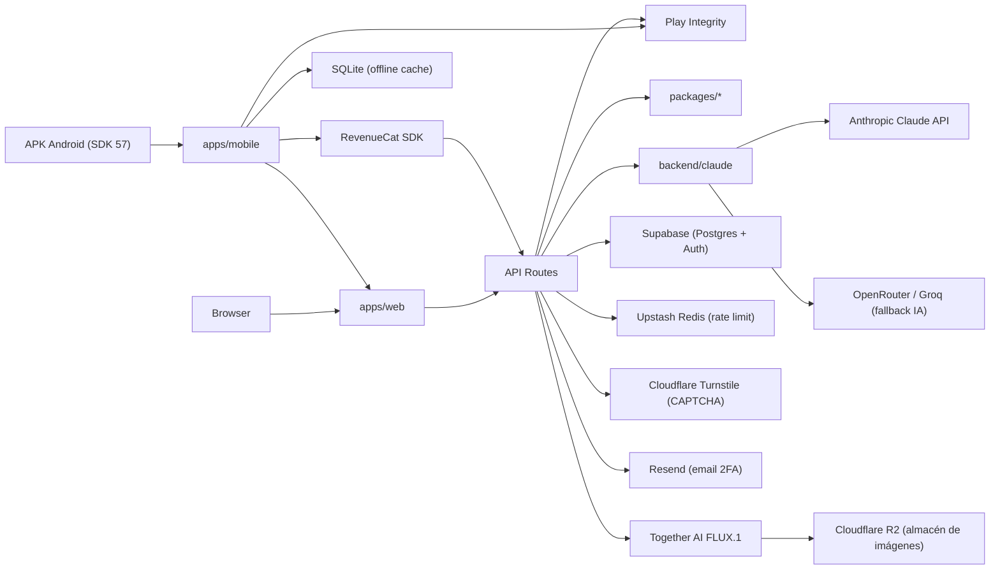
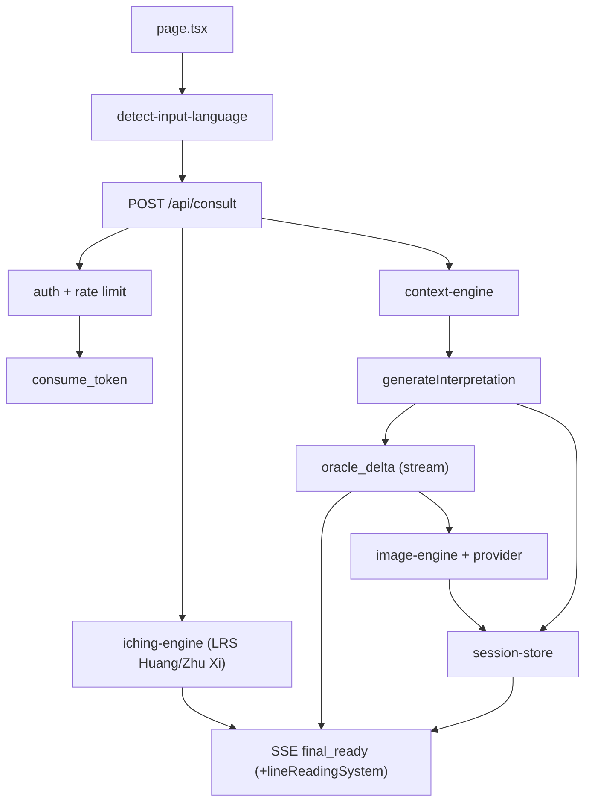
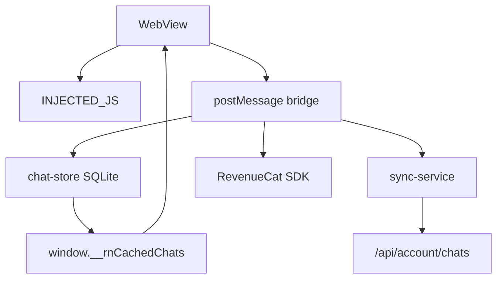
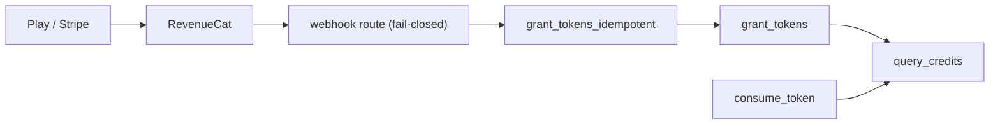

# Mapa de arquitectura del sistema (canvas del proyecto)

**Código:** `00000000-RPT-ARCH-02 system-canvas` · **Familia:** ARCH · **Estado:** reference

- **Release de referencia:** 4.2.5 (versionCode 65), Expo SDK 57 / RN 0.86 New Architecture, target API 36.
- **Actualizado:** 2026-07-17
- **Naturaleza:** artefacto canónico del proyecto, independiente de Cursor. Renderiza en GitHub, VS Code y cualquier visor Markdown (diagramas Mermaid). Reemplaza como fuente de verdad al `ARCHITECTURE_SYSTEM.canvas.tsx` (que era solo la vista interactiva de Cursor).
- **Referencia profunda:** [`00000000-RPT-ARCH-01-architecture-fullstack.md`](./00000000-RPT-ARCH-01-architecture-fullstack.md), `CLAUDE.md`, `README.md`.

Mantener este doc en el mismo commit que cualquier cambio de arquitectura (regla QMS: registrar en `registry.json` + `INDEX.md`).

---

## 1. Flujo end-to-end (capas + servicios)

## 2. Flujo de consulta al oráculo (SSE)

## 3. Flujo mobile (WebView ↔ nativo)

## 4. Flujo de billing (idempotente)

---

## 5. Módulos del monorepo

| Módulo | Ruta | Rol | Depende de |
|---|---|---|---|
| web | `apps/web` | Next.js 15 UI + API Routes | packages/*, backend/claude, Supabase |
| mobile | `apps/mobile` | Expo SDK 57 (RN 0.86, New Arch) WebView shell, SQLite, Play Billing, Play Integrity | web URL, @iching-oracle/i18n |
| iching-engine | `packages/iching-engine` | Sorteo monedas/varas; reglas Huang/Zhu Xi | iching-data |
| oracle-bones-engine | `packages/oracle-bones-engine` | Sorteo huesos Shang (4 veredictos) | — |
| context-engine | `packages/context-engine` | Límites de hilo, contexto de sesión por tier | i18n |
| image-engine | `packages/image-engine` | Prompts FLUX + negativos | — |
| i18n | `packages/i18n` | 11 locales, getters de UI | — |
| iching-data | `packages/iching-data` | 64 hexagramas estáticos (Wilhelm/Legge/Zhou Yi) | — |
| sharing | `packages/sharing` | URLs públicas de lecturas | — |
| ui | `packages/ui` | Componentes React compartidos | — |
| claude | `backend/claude` | Interpretación Anthropic + cadena de fallback | iching-engine, context-engine |
| auth-be | `backend/auth` | 2FA, TOTP, helpers bcrypt | — |
| db | `backend/db/migrations` | Schema Postgres, RPC de tokens (001-075, replayable) | Supabase |

## 6. Rutas API (por grupo)

| Grupo | Rutas |
|---|---|
| Oráculo | `POST /api/consult` (SSE stream_ritual + JSON manual) · `GET /api/mutation-explorer/consultation` · `GET /api/image-proxy` |
| Cuenta | `bootstrap` · `chats` · `sessions-only` · `me` · `display-name` · `delete` · `tour-complete` · `sync-billing` · `create-portal-session` |
| Auth | `register` · `legal-consent` · `change-password` · `sign-out` · `notify-password-changed` · `2fa/*` (enroll·verify·disable·challenge·email) · `verify-turnstile` |
| Integridad | `POST /api/integrity/challenge` · `POST /api/integrity/client-event` (Play Integrity attestation) |
| Billing | `POST /api/webhooks/revenuecat` (fail-closed: rechaza sandbox/test salvo `REVENUECAT_ALLOW_TEST_EVENTS`) |
| Biblioteca | `GET /api/library/[n]` (Bearer + Seeker+) · `GET /api/library/access` |
| Ops | `GET /api/health` · `POST /api/feedback` · `/api/admin/*` · `/api/ritual-debug` |

## 7. Historial de versiones (móvil)

| Versión | vc | Fecha | Etapa | Nota |
|---|---|---|---|---|
| 4.2.5 | 65 | 2026-07-17 | Production | Expo SDK 57 + RN 0.86 New Arch, target API 36; fix descarga imagen (media-library/legacy); D9 granularPermissions photo; diagrama single-hex sin mutación |
| 4.2.4 | 64 | 2026-07-16 | Built, not published | Primer SDK 57 (superseded por 4.2.5); expo doctor 20/20; migración 075 replayable |
| 4.2.2 | 62 | 2026-07-04 | Production | Último release pre-SDK-57; security hardening |
| 4.2.0 | 60 | 2026-06-25 | Production | Biblioteca de hexagramas; página de auditorías; gates RLS (`rls-test`) + `resolution-guard` |
| 4.1.7 | 57 | 2026-06-21 | Closed Testing | Selector Huang/Zhu Xi (074); detect-input-language; SSE final_ready lineReadingSystem |

---

## 8. Postura de seguridad (gates de CI)

- `ci` — typecheck + tests + build (bloqueante).
- `resolution-guard` — integridad del split react 18 (web) / 19.2.3 (mobile) del monorepo (bloqueante).
- `rls-test` — replay de la cadena 001-075 en base vacía + aislamiento RLS cross-user en las 9 tablas user-scoped (bloqueante).

> El `ARCHITECTURE_SYSTEM.canvas.tsx` sigue disponible como vista interactiva en Cursor, pero **este documento es la fuente de verdad** de la arquitectura y el que se registra y versiona con el proyecto.
