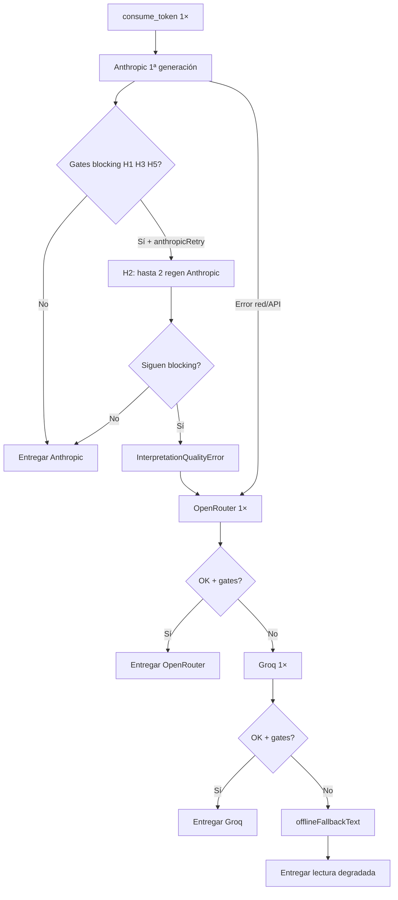

# Auditoría — Economía de reintentos LLM, cadena de fallback y entrega al usuario
**Código:** `20260622-AUD-MUT-05 retry-fallback-economics` · **Familia:** MUT · **Estado:** decided


- **Fecha:** 2026-06-22
- **Estado:** 🟢 **Decidida (2026-06-24)** — Opción 1 (status quo, no se ejecuta Fase 1) con datos reales de Axiom; ver §15
- **Disparador:** Política de negocio — tokens consumibles con margen ajustado; **reintento de calidad que duplique llamadas Anthropic no es viable** como estrategia permanente. Paralelo: el usuario **siempre debe recibir una respuesta** tras consumir token (disponibilidad ≠ reintento).
- **Alcance:** Generación de interpretación I Ching (`generateInterpretation`), gates H1–H7, H2 retry, cadena OpenRouter → Groq → offline, huesos de oráculo, reintentos 429, imagen Together. **Fuera de alcance:** billing web/Play, webhooks RevenueCat, refund automático por gates (ya cerrado en Opción B).
- **Relacionado:**
  - [20260615-AUD-MUT-02-prompt-mutation-gates.md](./20260615-AUD-MUT-02-prompt-mutation-gates.md) — Fase 2, Opción B (fallback chain + H2 retry)
  - [20260624-AUD-RDG-QA-02-verbatim-blockquote-gap.md](./20260624-AUD-RDG-QA-02-verbatim-blockquote-gap.md) — H7 warn-only, reintento H7 diferido
  - [20260616-AUD-PRD-02-general-pre-production.md](./20260616-AUD-PRD-02-general-pre-production.md) — §3 integridad financiera, §4 cadena fallback

---

## 1. Resumen ejecutivo

El producto vende **tokens consumibles** (1 por consulta I Ching; 2 en Master Combined). El usuario paga **una vez** por consulta (`consume_token` antes de generar). El riesgo económico de “reintentos” es **costo de API al proveedor**, no doble cobro al cliente.

Hoy coexisten **tres mecanismos distintos** bajo la palabra “retry”:

| Mecanismo | Propósito | ¿Regenera interpretación LLM? | ¿Activo hoy? |
|-----------|-----------|--------------------------------|--------------|
| **H2 — reintento de calidad** | Corregir fallo H1/H3/H5 tras 1ª respuesta | **Sí** — hasta **2** llamadas Anthropic extra | **Sí** (solo ruta Anthropic I Ching) |
| **429 — reintento de infraestructura** | Rate-limit HTTP sin respuesta | Reintenta la **misma** petición (máx. 2) | **Sí** |
| **Cadena de fallback** | Entregar lectura si Anthropic no sirve | **Sí** — OpenRouter → Groq → texto offline | **Sí** |

**H7 (juicio/imagen verbatim)** ya sigue la política deseada: **warn + Sentry, cero reintento**.

**Tensión central:** desactivar todo lo que cuesta tokens adicionales **sin** romper la promesa de que el usuario recibe su lectura. La cadena de fallback resuelve **disponibilidad**; H2 resuelve **calidad de mutaciones** a costo de hasta 3× Anthropic antes de siquiera probar OpenRouter.

**Recomendación preliminar (§9):** separar políticas — (1) **eliminar H2** y mover H1/H3/H5 hacia warn + telemetría + QA/prompt (modelo H7); (2) **conservar fallback chain** acotada a fallos de proveedor / agotamiento de calidad bloqueante, para garantizar entrega; (3) medir en Sentry antes de recortar fallbacks.

---

## 2. Principio rector — el usuario no se queda sin respuesta

Tras `consume_token` exitoso, el path de consulta **no debe terminar en error vacío** salvo fallo de persistencia pre-streaming (refund según CRIT-02).

Jerarquía de entrega actual (`backend/claude/src/interpretation.ts`):



**Garantía actual:** casi siempre hay texto persistible. El peor caso es `offlineFallbackText` — lectura provisional con regla de mutación, **no** interpretación rica (§6.3).

**Refund:** no automático si se persiste lectura (incluso degradada). Refund solo en paths de fallo real pre-entrega (`attemptRefund` en `apps/web/src/app/api/consult/route.ts`).

---

## 3. Modelo económico (token usuario vs costo API)

| Concepto | Comportamiento |
|----------|----------------|
| Cobro al usuario | 1 token (o 2 Master Combined), **una vez**, antes de generar |
| Reintentos H2 | **No** cobran token extra; **sí** multiplican factura Anthropic |
| Fallback OR/Groq | Mismo token; costo adicional del proveedor alternativo |
| Offline fallback | Mismo token; costo API ≈ 0 |
| Imagen Together | Independiente del token interpretación; 1 retry en 5xx |

**Peor caso teórico I Ching (Anthropic + H2 + fallbacks):**

| Paso | Llamadas LLM interpretación |
|------|----------------------------|
| 1ª Anthropic | 1 |
| H2 (máx. 2) | +2 |
| OpenRouter | +1 |
| Groq | +1 |
| **Total** | **hasta 5** generaciones por 1 token vendido |

**Caso frecuente NO_CHANGING:** H1 pasa vacío (`selectedLineTexts.length === 0`), H3 no aplica, H5 solo en Qian/Kun 6/6 → **H2 casi nunca dispara** → suele **1× Anthropic**.

**Caso de riesgo:** consultas con líneas mutantes (H1/H3/H5 activos) — ahí H2 **sí** puede triplicar costo Anthropic antes del fallback.

---

## 4. Inventario detallado por gate

Fuente: `interpretation-output-validator.ts`, `apply-interpretation-gates.ts`.

| Gate | Valida | Severidad | Reintento Anthropic H2 | Si falla tras todo |
|------|--------|-----------|------------------------|-------------------|
| **H1** | Huella de líneas seleccionadas citadas | Blocking | **Sí** (máx. 2) | Fallback chain |
| **H3** | No fabricar líneas omitidas | Blocking | **Sí** | Fallback chain |
| **H5** | 用九/用六 / no líneas sueltas Qian-Kun | Blocking | **Sí** | Fallback chain |
| **H1b** | Blockquote de línea en sección | Warn | No | Entrega + Sentry |
| **H4** | Códigos internos filtrados | Warn | No | Entrega + Sentry |
| **H6** | Estructura `##` ritual | Warn | No | Entrega + Sentry |
| **H7** | Juicio/imagen verbatim | Warn | **No** (explícito) | Entrega + Sentry |

Wire H2 (solo Anthropic I Ching):

```138:185:backend/claude/src/apply-interpretation-gates.ts
  if (hasBlockingFailures(validation) && anthropicRetry) {
    // ...
    for (let attempt = 0; attempt < 2; attempt++) {
      // callAnthropicWithRetry → nueva generación completa
    }
  }
```

OpenRouter/Groq llaman `applyInterpretationGates` **sin** `anthropicRetry` → cero H2; si blocking persiste → siguiente eslabón o offline.

---

## 5. Tipologías de reintento (definiciones)

### 5.1 H2 — reintento de calidad (el conflictivo para margen)

- **Qué:** nueva generación con recordatorio de cita (`buildLineCitationRetryParams` / `buildExtendedLineCitationRetryParams`).
- **Cuándo:** H1, H3 o H5 blocking tras la 1ª respuesta Anthropic.
- **Costo:** prompt completo + output otra vez (hasta **+200%** costo Anthropic en peor caso).
- **Streaming:** si la 1ª respuesta ya emitió deltas SSE, H2 usa llamada **no streaming** — el usuario pudo ver texto que luego se descarta; costo doble + UX inconsistente.
- **Política documentada:** Opción B, jun 2025 — priorizaba calidad mutaciones sobre costo API.

### 5.2 429 — reintento de infraestructura (aceptable)

- **Dónde:** `anthropic-client.ts` — `callAnthropicWithRetry` / streaming solo si **no** hubo delta aún.
- **Costo:** solo si la llamada anterior falló sin entregar texto; no es “segunda interpretación por calidad”.
- **Recomendación:** **mantener** — protege disponibilidad sin política de calidad.

### 5.3 Cadena de fallback — disponibilidad + segunda oportunidad de calidad

- **Qué:** otro proveedor regenera desde cero (prompt reducido en Groq).
- **Disparadores:** error Anthropic, idioma incorrecto, o `InterpretationQualityError` tras agotar H2.
- **Costo:** 1–2 LLM extra; **beneficio al usuario:** sigue recibiendo lectura.
- **Calidad:** OpenRouter/Groq pueden corregir fabricación H3; también pueden ser peores en verbatim o ritmo ritual.
- **Distinto de H2:** no es “misma marca, tercer intento”; es **plan B de producto** para no fallar la consulta.

### 5.4 Imagen Together (fuera interpretación, mismo espíritu económico)

- `image-provider.ts`: 1 retry en HTTP **5xx**; timeout sin retry automático de calidad.
- Costo acotado (~$0.002–0.006/img); no afecta token interpretación.

---

## 6. Calidad entregada al cliente por tier de respuesta

| Tier | Origen | Calidad esperada | Token consumido |
|------|--------|------------------|-----------------|
| **A — Anthropic OK** | 1ª gen o H2 exitoso | Máxima (prompt completo, caché, ritual) | 1 |
| **B — Fallback OR/Groq** | Tras fallo Anthropic/gates | Variable; prompt Groq recortado | 1 |
| **C — Offline** | `offlineFallbackText` | Degradada: mensaje `[Sin conexión / groq_error]` + `ruleExplanation` | 1 |
| **D — Huesos de oráculo offline** | `oracleBonesFallbackProse` | Prosa mínima coherente con veredicto | 1 |

**Compromiso de producto implícito hoy:** el usuario **siempre** recibe tier A–C persistido; tier C es pobre pero cumple “no quedarse en blanco”.

**H7 en tier A:** drift juicio/imagen posible → usuario ve lectura; Sentry registra; **no** se gasta token extra corrigiendo.

---

## 7. Huesos de oráculo — sin H2

`generateOracleBonesInterpretation` **no** usa `applyInterpretationGates` ni H2. Solo: Anthropic → OpenRouter → Groq → `oracleBonesFallbackProse`.

| | I Ching ritual | Oracle Bones |
|--|----------------|--------------|
| H2 retry | Sí (Anthropic) | No |
| Fallback chain | Sí | Sí |
| Gates H1–H7 | Sí | No |

Menor riesgo de triple Anthropic en huesos; mismo riesgo de fallback multi-proveedor.

---

## 8. Matriz tensión: economía × calidad × entrega

| Acción | Ahorro API | Riesgo calidad mutaciones | Riesgo “sin respuesta” |
|--------|------------|---------------------------|-------------------------|
| Quitar H2 | **Alto** en tiradas mutantes | Medio — más respuestas Anthropic con H1/H3/H5 fallidos van directo a fallback | Bajo — fallback sigue |
| Quitar fallback OR/Groq | **Alto** en outages | Bajo si Anthropic OK | **Alto** — offline tier C más frecuente |
| H1/H3/H5 → warn-only (como H7) | Alto (elimina presión de retry + fallback por gates) | **Alto** — fabricación de líneas visible al usuario | Bajo |
| Mantener status quo | Ninguno | Menor en mutaciones | Mínimo |

**Conclusión analítica:** H2 y fallback resuelven problemas **ortogonales**:

- **H2** = pagar Anthropic otra vez por calidad.
- **Fallback** = pagar **otro** proveedor (o entregar tier C) por **disponibilidad**.

Recortar fallback rompe la promesa “siempre hay respuesta”. Recortar H2 alinea economía con H7 sin eliminar fallback.

---

## 9. Opciones de política (requieren aprobación explícita)

### Opción 1 — Conservadora (status quo documentado)

- Mantener H2 + fallback.
- **Pros:** máxima calidad mutaciones; entrega garantizada.
- **Contras:** peor margen; hasta 5× LLM; contradice política “sin reintento de calidad”.

### Opción 2 — Recomendada: “H7 model” + fallback preservado

1. **Desactivar H2:** quitar `anthropicRetry` de `applyInterpretationGates` (o flag `INTERPRETATION_QUALITY_RETRY=0`).
2. **Mantener H1/H3/H5 blocking** para disparar fallback **sin** regen Anthropic intermedia:
   - 1× Anthropic → si blocking → OpenRouter → Groq → offline.
   - Ahorro: hasta **2 llamadas Anthropic** por consulta problemática.
3. **H1b/H4/H6/H7:** warn-only + Sentry (sin cambio).
4. **Inversión en calidad sin tokens:** prompt, fixtures `npm run qa:mutation-output`, `qa:reading-quality`, ampliar cobertura H7 offline.
5. **Métricas gate:** dashboard Sentry `interpretation_quality_gate_failed`, `line_citation_missing`, `judgment_image_verbatim_drift` — volumen antes de endurecer.

**Pros:** alinea margen con H7; usuario sigue con respuesta vía fallback.  
**Contras:** primera respuesta Anthropic defectuosa puede llegar al usuario si blocking se relaja; con blocking + sin H2, el usuario ve fallback (tier B) en lugar de 2ª Anthropic.

### Opción 3 — Agresiva economía (no recomendada sin datos)

- Opción 2 + fallback solo en **error HTTP**, no en `InterpretationQualityError`.
- **Pros:** mínimo costo API.
- **Contras:** más tier C offline; calidad percibida cae en outages parciales de calidad.

---

## 10. Plan de implementación propuesto (post-aprobación)

| Fase | Acción | Verificación |
|------|--------|--------------|
| **0 — Baseline** | Exportar 30 días Sentry: H2 implícito (quality_gate_failed por provider), drift H7, fallback rate | Informe números en este doc §11 |
| **1 — Kill H2** | PR: `anthropicRetry` opcional default off; telemetría `h2_retry_disabled` | `qa:mutation-output` sin regresión blocking; smoke staging 10 consultas mutantes |
| **2 — Prompt/QA** | Priorizar fixtures H3/H5 en harness; revisar recordatorios en prompt (sin 2ª llamada) | Matriz QA verde en gates blocking |
| **3 — Fallback review** | Documentar tier B vs C en `/notes` interno si sube offline rate | Axiom: `provider` en consult logs |
| **4 — Revisión 60 días** | Si offline > umbral X% → reevaluar OR/Groq, **no** reactivar H2 sin datos | Go/no-go |

**No implementar Fase 1 hasta aprobación explícita del propietario.**

---

## 11. Métricas y telemetría existentes

| Evento Sentry | Significado |
|---------------|-------------|
| `[iching] line_citation_missing` | H1 blocking (pre/post H2 según política) |
| `[iching] line_fabrication_detected` | H3 blocking |
| `[iching] special_yao_gate_failed` | H5 blocking |
| `[iching] interpretation_quality_gate_failed` | Blocking persiste; fallback activado |
| `[iching] judgment_image_verbatim_drift` | H7 warn |
| `[iching] line_blockquote_missing` | H1b warn |

**Gap:** no hay evento dedicado “H2 attempt N succeeded/failed” — inferir por múltiples `generationMs` Anthropic en Axiom o añadir span en Fase 1.

---

## 12. Checklist de verificación reproducible

```bash
# Gates unitarios (sin API)
npm run test --workspace=@iching-oracle/claude

# QA mutaciones (consume API si se ejecuta completo)
npm run qa:mutation-output

# QA lectura + columna H7
npm run build --workspace=@iching-oracle/claude
npm run qa:reading-quality -- --random 3 --translators wilhelm,legge
```

Criterio binario post-cambio (Opción 2):

- [ ] Usuario recibe texto persistido en 100% smokes (incl. simular Anthropic gate fail → fallback)
- [ ] Cero llamadas Anthropic adicionales por H2 en logs Axiom
- [ ] Blocking H3 sigue detectado (unit + QA); entrega vía fallback si Anthropic falla
- [ ] H7 sigue warn-only

---

## 13. Commits / código de referencia

| Área | Archivo principal |
|------|-------------------|
| H2 orchestration | `backend/claude/src/apply-interpretation-gates.ts` |
| Gates | `backend/claude/src/interpretation-output-validator.ts` |
| H7 sin retry | `backend/claude/src/interpretation-judgment-image-gate.ts` |
| Fallback chain | `backend/claude/src/interpretation.ts` (~L850–L1136) |
| Consume token | `apps/web/src/app/api/consult/route.ts` (~L728) |
| Refund | `apps/web/src/app/api/consult/route.ts` `attemptRefund` |
| Opción B original | `docs/auditorias/20260615-AUD-MUT-02-prompt-mutation-gates.md` §PR2 |

---

## 14. Estado y siguiente paso

| Ítem | Estado |
|------|--------|
| Inventario código | ✅ Este documento |
| Decisión kill H2 | ⏳ Pendiente propietario |
| Preservar fallback entrega | ✅ Recomendado |
| H7 sin reintento | ✅ Ya en prod |
| Baseline Sentry 30d | ⏳ Opcional pre-cambio |

**Siguiente paso sugerido:** aprobar Opción 2 (o variante) → Fase 0 baseline → PR kill H2 con fallback intacto.

---

## 15. Decisión con datos reales (2026-06-24, Claude Sonnet 4.6)

Se ejecutó la **Fase 0 — Baseline** que este documento pedía antes de aprobar cualquier fase de
implementación, vía Axiom (`iching-app-main`, ver `reference_axiom_query.md` en memoria de
sesión) en vez de Sentry directo — **hallazgo de proceso**: los eventos Sentry listados en §11
(`[iching] line_citation_missing`, `interpretation_quality_gate_failed`, etc.) **no aparecen en
absoluto** en este dataset de Axiom (`message contains "..."` → 0 filas en 30 días). El logger
estructurado propio de la app sí llega a Axiom (`message: "consult_phase"`, columnas `fields.*`),
pero `Sentry.captureMessage` parece ser un destino separado que este dataset no captura — quien
quiera esos eventos específicos debe consultar el dashboard de Sentry directamente, no asumir que
Axiom los tiene (corrige un supuesto implícito de §10 Fase 0 / §11).

**Datos reales obtenidos (ventana 30–60 días, 2026-06-24):**

| Métrica | Valor |
|---|---|
| Consultas con `consume_token` (30 días) | **69** |
| Líneas `consult_phase` con `fields.model` poblado (30 días) | **25**, todas `claude-sonnet-4-6` |
| Apariciones de modelo OpenRouter o Groq en `fields.model` (60 días) | **0** |
| Líneas con `message` conteniendo "quality gates failed" (30 días) | **0** |
| Eventos `line_citation_missing` / `line_fabrication_detected` / `special_yao_gate_failed` / `interpretation_quality_gate_failed` / `judgment_image_verbatim_drift` en Axiom (30 días) | **0** (ver hallazgo de proceso arriba — puede ser gap de telemetría, no necesariamente cero fallos reales) |

**Lectura:** con ~70 consultas/mes, la cadena de fallback a OpenRouter/Groq **no se ha activado
ni una vez** en 60 días — ni por fallo de red ni por gate. Esto significa que, al volumen actual,
**H2 tampoco llega a agotar sus 2 reintentos**: el ahorro real de eliminarlo (Opción 2) es
indistinguible de cero, y el riesgo de degradar Tier A más seguido (la contrapartida de
eliminarlo) también es ~cero, porque el evento que dispara cualquiera de los dos lados nunca
ocurre a este volumen.

**Decisión:** se mantiene **Opción 1 (status quo)** — no se ejecuta la Fase 1 ("Kill H2") por
ahora. No es un rechazo de la Opción 2 en principio (el razonamiento de §8/§9 sobre por qué H2 y
fallback son ortogonales sigue siendo correcto); es que, sin datos que muestren H2 disparando con
frecuencia, cambiarlo no tiene retorno medible hoy y sí carga de revisión/QA.

**Re-abrir cuando:** el volumen de consultas crezca significativamente (ej. 10×) — repetir esta
misma consulta a Axiom/Sentry antes de decidir, no asumir que la conclusión de 2026-06-24 sigue
vigente a otro volumen. Detalle completo de la metodología de consulta en memoria de sesión
(`reference_axiom_query.md`, `project_h2_retry_decision_2026-06.md`).

### Actualización §14

| Ítem | Estado |
|------|--------|
| Inventario código | ✅ |
| Decisión kill H2 | ✅ **No, por ahora** (datos reales 2026-06-24, ver arriba) |
| Preservar fallback entrega | ✅ Sin cambios |
| H7 sin reintento | ✅ En prod |
| Baseline Sentry/Axiom 30-60d | ✅ Completado 2026-06-24 (vía Axiom, no Sentry — ver hallazgo de proceso) |
