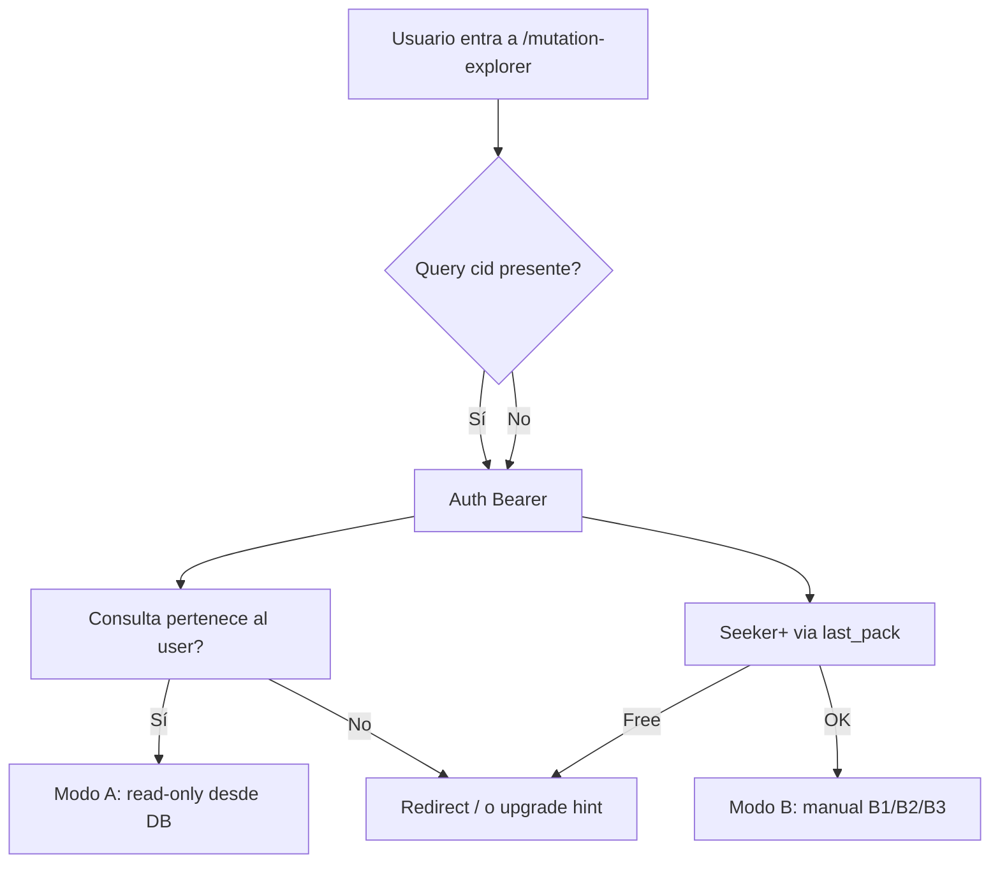
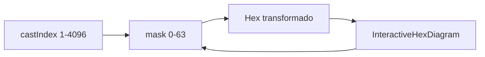

# Plan de implementación — Mutation Explorer (Verificador de reglas)

**Código:** `20260628-PLAN-MUT-07 mutation-explorer-implementation` · **Familia:** MUT · **Estado:** open

- **Fecha:** 2026-06-28
- **Rama:** `feature/mutation-explorer`
- **Doc base (producto/arquitectura):** [`20260628-PLAN-MUT-06-mutation-explorer.md`](./20260628-PLAN-MUT-06-mutation-explorer.md)
- **Objetivo:** implementar el Verificador de reglas de mutación (`/mutation-explorer`) con motor `castIndex` 1–4096, catálogo local, resumen enriquecido, modos A (desde consulta, free) y B (manual Seeker+), sin Supabase para textos oráculo.

---

## Decisión de acceso (cerrada)

| Superficie | Tier | Comportamiento |
|------------|------|----------------|
| Link «Verificar reglas →» en resumen (`?cid=`) | **Autenticado free+** | Solo consultas **propias**; modo A read-only; botón volver al hilo |
| Botón «Verificador de reglas» en Opciones | **Seeker+** (como Biblioteca) | Mismo disable que `openLibrary` en `home-chrome-ui.ts`: `!accessToken \|\| (!isAdmin && tierAccessKey === "free")` |
| `/mutation-explorer` sin `?cid=` | **Seeker+** | Modo manual B1/B2/B3; redirect a `/` si free |
| Textos W/L/Z | Sin tier extra | Siempre desde `@iching-oracle/iching-data` local |



---

## Arquitectura de datos

### `castIndex` (1–4096, nunca 0)

- Fórmula: `castIndex = (primary − 1) × 64 + mask + 1`
- `mask`: 6 bits; bit `(pos − 1)` = 1 si la línea `pos` muta (1 = inferior)
- Decodificación: `n = castIndex − 1` → `primary = floor(n/64)+1`, `mask = n % 64`
- Ejemplo canónico **9→54** (mutan 3,4,5,6): `mask=60`, **`castIndex=573`**, líneas `[7,7,9,6,9,9]`

**Persistencia DB:** **no migrar** columna `cast_index`. Derivar en runtime:

```typescript
function maskFromChangingLines(changingLines: number[]): number {
  return changingLines.reduce((m, pos) => m | (1 << (pos - 1)), 0);
}
// castIndex = encodeCastIndex(primaryHexagram, mask)
```

Fuente de verdad existente: `primary_hexagram_number` + `changing_lines` en `apps/web/src/lib/session-store.ts`.

### Catálogo índice (sin duplicar textos)

**Nuevo:** `packages/iching-data/src/generated/cast-catalog.json` — 4096 filas.

Esquema por fila:

```typescript
type CastCatalogEntry = {
  castIndex: number;           // 1–4096
  primary: number;
  mask: number;
  transformed: number;
  changingLines: number[];
  lineValues: [6|7|8|9, ...];  // 6 posiciones, únicas por par
  huang: {
    rule: MutationRule;
    selections: MutationTextSelection[];
  };
  zhuxi: {
    rule: ZhuXiMutationRule;
    selections: MutationTextSelection[];
  };
};

type MutationTextSelection = {
  kind: "line" | "judgment" | "image" | "yong";
  hex: number;
  position?: number;
  emphasis?: "primary" | "secondary";
  judgmentScope?: "primary" | "transformed";
};
```

**Generador:** `scripts/generate-cast-catalog.mjs`

- Itera `primary` 1–64, `mask` 0–63
- Llama motor (`exploreMutation` / `selectTextsForClaude` + Zhu Xi)
- Escribe JSON + checksum en manifest

**Gate:** `npm run verify:cast-catalog` — compara cada fila contra motor en vivo (4096/4096).

**Export helpers** en `packages/iching-data/src/index.ts`:

- `getCastCatalogEntry(castIndex)`
- `encodeCastIndex(primary, mask)` / `decodeCastIndex(castIndex)`

---

## Fase 0b — Resumen enriquecido (primera entrega UX)

**Objetivo:** visible en chat sin esperar UI completa del explorer.

### Cambios en `apps/web/src/components/ConsultationRecordCard.tsx`

**Regla estricta:** no tocar filas existentes (trace, rule, translator, lineReading, thread, question). **Solo insertar** después de «Regla de lectura» y **antes** de «Traductor»:

1. **Código de verificación** — valor numérico `573` (prop `castIndex: number`)
2. **Líneas mutantes** — `3, 4, 5, 6` o i18n «Ninguna» (prop `changingLines: number[]`)
3. **CTA** — link `<a href="/mutation-explorer?cid={consultationId}">` con copy i18n

Props nuevas:

```typescript
castIndex?: number;
changingLines?: number[];
verifyRulesHref?: string; // o derivar internamente desde consultationId
```

### i18n — `packages/i18n/src/messages/consultation-record-ui.ts`

Claves nuevas (11 locales):

| Clave | ES (ejemplo) | EN |
|-------|--------------|-----|
| `verificationCode` | Código de verificación: | Verification code: |
| `changingLinesLabel` | Líneas mutantes: | Changing lines: |
| `changingLinesNone` | Ninguna | None |
| `verifyRulesLink` | Verificar reglas → | Verify rules → |

### Wiring en `apps/web/src/app/page.tsx`

En las 3 instancias de `ConsultationRecordCard` (~4858, 4886, 4951):

```typescript
castIndex={encodeCastIndex(entry.primaryHexagram, maskFromChangingLines(entry.changingLines))}
changingLines={entry.changingLines}
```

`ConsultationItem` ya expone `changingLines` (línea ~228). Import desde `@iching-oracle/iching-engine`.

**Gate del link:** visible para cualquier usuario autenticado en su hilo (free incluido). No requiere Seeker+.

---

## Fase 1 — Motor + catálogo + tests

### Nuevo módulo `packages/iching-engine/src/mutation-explore.ts`

Funciones públicas:

| Función | Responsabilidad |
|---------|-----------------|
| `encodeCastIndex(primary, mask)` / `decodeCastIndex(n)` | Codificación 1–4096 |
| `maskFromChangingLines(lines)` / `changingLinesFromMask(mask)` | Conversión máscara ↔ posiciones |
| `deriveChangingLinesFromHexPair(primary, transformed)` | Diff `binaryTopFirst` (Wilhelm); error si Hamming > 6 |
| `buildSyntheticLinesFromMask(primary, mask)` | `[6\|7\|8\|9]×6` únicos: mutante = 6/9 según bit primario; estable = 7/8 |
| `applyMaskToPrimary(primary, mask)` | Calcula hex transformado (flip bits) |
| `exploreMutation(input)` | Orquestador principal |

```typescript
export type MutationExploreInput = {
  primaryNumber: number;
  transformedNumber?: number;  // alternativa a mask/castIndex
  mask?: number;
  castIndex?: number;
  lineReadingSystem: LineReadingSystem;
  lines?: Line[];              // modo A: líneas reales de DB → paridad 100%
};

export type MutationExploreResult = {
  castIndex: number;
  primaryNumber: number;
  transformedNumber: number;
  changingLines: number[];
  stableLines: number[];
  mutationRule: AnyMutationRule;
  lineReadingSystem: LineReadingSystem;
  textsByTranslator: Record<"wilhelm"|"legge"|"zhouyi", TextsForClaude>;
  selections: MutationTextSelection[];
  linesUsed: Line[];
};
```

**Flujo `exploreMutation`:**

1. Resolver `(primary, mask)` desde `castIndex` | `(primary, transformed)` | `mask`
2. Si `lines` provistas → usarlas; si no → `buildSyntheticLinesFromMask`
3. `determineMutationRule` (Huang) o `determineMutationRuleZhuXi` según `lineReadingSystem`
4. `selectTextsForClaude` / `selectTextsZhuXi` con traductor wilhelm (reglas); resolver textos W/L/Z en capa web
5. Mapear `TextsForClaude` → `selections[]` estructuradas para UI

**Reutilizar** (no reimplementar):

- `packages/iching-engine/src/engine.ts`: `determineMutationRule`, `selectTextsForClaude`, `applyMutations`
- `packages/iching-engine/src/rules/zhuxi.ts`: `determineMutationRuleZhuXi`, `selectTextsZhuXi`
- `packages/iching-data/src/index.ts`: `getHexagramRecordByNumber`, `getHexagramRecordByBinaryTopFirst`

**Export** en `packages/iching-engine/src/index.ts`.

### Tests — `packages/iching-engine/src/mutation-explore.test.ts`

Mínimo **20 casos**:

| Caso | Assert |
|------|--------|
| 9→54 Zhu Xi | `ZX_FOUR_LOWER`, selections L1+L2 hex **54** |
| 9→54 Huang | `FOUR_LOWEST_STABLE`, solo L2 hex **54** |
| Sin mutación (mask=0) | `NO_CHANGING` / `ZX_ZERO`, castIndex = `(p-1)*64+1` |
| 1 mutación | `ONE_CHANGING` / `ZX_ONE` |
| 2 mutaciones | regla Huang correcta según yin/yang |
| 3 mutaciones Zhu Xi | `ZX_THREE_JUDGMENTS`, juicios dual (sin líneas) |
| Qian 6×9 | `QIAN_ALL_NINE` |
| Kun 6×6 | `KUN_ALL_SIX` |
| Par inválido (Hamming>6) | throw / error tipado |
| Round-trip castIndex | encode/decode 4096 índices |
| Barrido 64×64 | 0 ambigüedades en `lineValues` |
| Paridad catálogo | sample 64 filas vs `exploreMutation` |

**QA registry** (WF-DOC-02): registrar `TS-ENG-004 mutation-explore` en `docs/qa/registry.json` + `docs/qa/INDEX.md`.

---

## Fase 2 — i18n explorer

**Nuevo:** `packages/i18n/src/messages/mutation-explorer-ui.ts`

Bloques (EN fuente → 10 locales):

- Meta: `pageTitle`, `pageDescription`, `subtitle`
- Modo A: `fromConsultationBanner`, `backToThread`, `consultationRef`
- Modo B: `manualTitle`, `castIndexLabel`, `primaryHexLabel`, `transformedHexLabel`, `verifyButton`, `swapHexes`, `clearSelection`
- B3 diagrama: `lineToggleLabel`, `lineMutating`, `lineStable`, `interactiveHint`
- Resultados: `ruleApplied`, `changingLines`, `stableLines`, `oracleTexts`, `compareOtherSystem`
- Tabs: reutilizar labels de `library-page-ui.ts` si existen
- Badges: `primaryEmphasis`, `secondaryEmphasis`, `judgmentPrimary`, `judgmentTransformed`, `yongJiu`, `yongLiu`
- Errores: `invalidHexPair`, `castIndexOutOfRange`, `upgradeRequiredManual`
- `masterCombinedNote`: «Esta consulta usó traducción combinada; aquí se muestran Wilhelm, Legge y Zhou Yi por separado.»

**Panel Opciones** — ampliar `packages/i18n/src/messages/home-chrome-ui.ts`:

- `libraryHeading`: **«Biblioteca y verificación»** (o mantener «Biblioteca» + descripción ampliada — decidir en implementación)
- `libraryDescription`: mencionar verificador de reglas
- `openMutationExplorer`: «Verificador de reglas»

Export: `getMutationExplorerUiMessages(locale)` en `packages/i18n/src/index.ts`.

**Gate:** `npm run i18n:audit`

---

## Fase 3 — UI `/mutation-explorer`

### Página

`apps/web/src/app/mutation-explorer/page.tsx`

- Shell doc existente (como `/library`)
- Client island principal

### Componentes — `apps/web/src/components/mutation-explorer/`

| Componente | Rol |
|------------|-----|
| `MutationExplorerAccessGate.tsx` | Gate dual: `?cid=` → auth+ownership; sin cid → Seeker+ |
| `MutationExplorer.tsx` | Estado global, routing modos A/B |
| `ConsultationVerifyBanner.tsx` | Modo A: ref consulta, fecha, volver |
| `ManualInputPanel.tsx` | Tabs B1/B2/B3 |
| `CastIndexInput.tsx` | B1: input 1–4096 |
| `HexagramPairPicker.tsx` | B2: dos pickers 1–64 (reutilizar patrón `LibraryIndex.tsx`) |
| `InteractiveHexDiagram.tsx` | B3: 6 barras toggle; estilos `.ritual-hex-line` de `globals.css` |
| `ChangingLinesDiagram.tsx` | Solo lectura (modo A + panel resultados) |
| `MutationResultPanel.tsx` | Regla + código + diagrama + tabs |
| `OracleTextTabs.tsx` | Wilhelm \| Legge \| Zhou Yi (patrón `HexagramTabs.tsx`) |
| `OracleTextBlock.tsx` | Render verbatim: línea, juicio, imagen, 用九/用六 con badges |

### Thin wrapper server-safe

`apps/web/src/lib/mutation-explorer/explore-mutation.ts`

- Resuelve textos verbatim desde bundles por `selections[]`
- Sin fetch de red para textos

### Sincronización B3 (fuente de verdad `(primary, mask)`)



- Cambiar toggles → recalcular `transformed` + `castIndex`
- Elegir hex transformado en picker → actualizar toggles (diff bits)
- Conflicto B1 vs B3 → última edición gana; mostrar valor unificado

### Estilos

Bloque `.mutation-explorer-*` en `apps/web/src/app/globals.css`: reutilizar tokens existentes; mutante = dorado/ámbar como ritual.

---

## Fase 4 — API modo A (cold load)

Necesaria cuando el usuario abre `?cid=` sin hilo en memoria (reload, deep link, WebView).

**Nuevo:** `apps/web/src/app/api/mutation-explorer/consultation/route.ts`

```
GET /api/mutation-explorer/consultation?cid={uuid}
Authorization: Bearer …
```

Respuesta (200):

```typescript
{
  consultationId: string;
  primaryHexagram: number;
  transformedHexagram: number | null;
  changingLines: number[];
  lines: number[];              // valores 6/7/8/9
  mutationRule: string;
  lineReadingSystem: "huang" | "zhuxi";
  translator: "wilhelm" | "legge" | "zhouyi" | "master_combined";
  castIndex: number;
  sessionPosition: number;
  question: string;
  createdAt: string;
}
```

Validaciones:

- 401 sin auth
- 403 si consulta no pertenece al user (join `consultation_sessions.user_id`)
- 404 si cid inexistente
- **Free tier permitido** (diferencia clave vs `/api/library/access`)

Query Supabase: reutilizar columnas ya en `session-store.ts` (`lines`, `changing_lines`, hex, `mutation_rule`, `line_reading_system`).

`MutationExplorer.tsx`:

- Si `?cid=` → fetch API → `exploreMutation({ lines, lineReadingSystem, ... })` → render modo A
- Selector Huang/Zhu Xi **prefilled** pero editable para «Ver regla bajo [otro sistema]»

---

## Fase 5 — Panel Opciones + gates

### `apps/web/src/app/page.tsx` ~5892

Ampliar bloque Biblioteca existente (Tokens/Seguridad/Zona de peligro **intactos**):

```tsx
<div className="composer-panel-actions">
  <button … onClick={() => router.push("/library")} disabled={!accessToken || (!isAdmin && tierAccessKey === "free")}>
    {chrome.openLibrary}
  </button>
  <button … onClick={() => router.push("/mutation-explorer")} disabled={!accessToken || (!isAdmin && tierAccessKey === "free")}>
    {chrome.openMutationExplorer}
  </button>
</div>
```

### Gate componente

`apps/web/src/components/mutation-explorer/MutationExplorerAccessGate.tsx`:

- Patrón similar a `LibraryAccessGate.tsx`
- Rama `cid`: auth + fetch consultation (free OK)
- Rama manual: reutilizar lógica de `/api/library/access` (Seeker+)

**No reutilizar** `LibraryAccessGate` directamente — comportamiento distinto con `?cid=`.

---

## Fase 6 — QA smoke y docs (post-staging)

### Smoke manual (checklist)

1. Consulta real 9→54 Zhu Xi → resumen muestra `573`, líneas `3, 4, 5, 6`, link verify
2. Modo A free → explorer read-only, textos L1+L2 hex 54 en W/L/Z
3. Modo A Huang toggle → `FOUR_LOWEST_STABLE`, solo L2 hex 54
4. Seeker+ → `/mutation-explorer` manual B3 toggle → sync transformado
5. Free → botón Opciones deshabilitado; URL manual sin cid → redirect
6. 11 idiomas en labels nuevos
7. WebView APK: deploy web + verificar ruta

### Script opcional

Extender `scripts/mutation-output-qa.mjs` o one-shot: N fixtures vs `exploreMutation` (paridad regla + selections).

### Docs producto (WF-DOC-01, **después** de validar staging)

- FAQ/guía: «Cómo verificar las reglas de mutación»
- **No** entrar en `/audits` (no es fidelidad de dataset)

---

## Orden de commits sugerido

1. **Fase 1** — motor + tests + generador catálogo + `verify:cast-catalog`
2. **Fase 0b + 2** — resumen + i18n consultation-record + mutation-explorer-ui
3. **Fase 3 + 4** — UI explorer + API cid
4. **Fase 5** — gates + panel Opciones
5. **Fase 6** — QA registry TS-ENG-004 + smoke

Merge a `staging` solo tras validación explícita del usuario.

---

## Fuera de alcance (Fase 1)

- Comentarios clásicos W/L de biblioteca
- Export PDF del verificador (opcional futuro)
- Cuarta pestaña `master_combined`
- Persistir `cast_index` en Postgres
- Cambiar billing / product IDs

---

## Criterios de aceptación (definición de done)

1. 9→54 + Zhu Xi → `ZX_FOUR_LOWER`, textos L1+L2 hex 54 en W/L/Z
2. Mismo par + Huang → `FOUR_LOWEST_STABLE`, solo L2 hex 54
3. `?cid=` reproduce regla/selección idéntica al motor de la consulta real
4. Free: verify desde resumen OK; manual bloqueado
5. Seeker+: manual B1/B2/B3 OK
6. i18n 11 idiomas
7. Sin Supabase para textos oráculo
8. Tests motor ≥20 casos + paridad 4096 catálogo

---

## Checklist de implementación

- [ ] Fase 1: `mutation-explore.ts` + encodeCastIndex + tests ≥20 casos + `generate-cast-catalog.mjs` + `verify:cast-catalog` + TS-ENG-004 registry
- [ ] Fase 0b: `ConsultationRecordCard` (castIndex, changingLines, link verify) + `consultation-record-ui.ts` + wiring `page.tsx`
- [ ] Fase 2: `mutation-explorer-ui.ts` (11 locales) + `home-chrome-ui` openMutationExplorer + `i18n:audit`
- [ ] Fase 3: `/mutation-explorer` page + componentes (B1/B2/B3, resultados, tabs W/L/Z) + `globals.css`
- [ ] Fase 4: `GET /api/mutation-explorer/consultation?cid=` (auth+ownership, free OK) + hydration modo A
- [ ] Fase 5: `MutationExplorerAccessGate` (dual tier) + segundo botón panel Opciones Seeker+
- [ ] Fase 6: smoke checklist + paridad fixtures + docs FAQ post-staging
