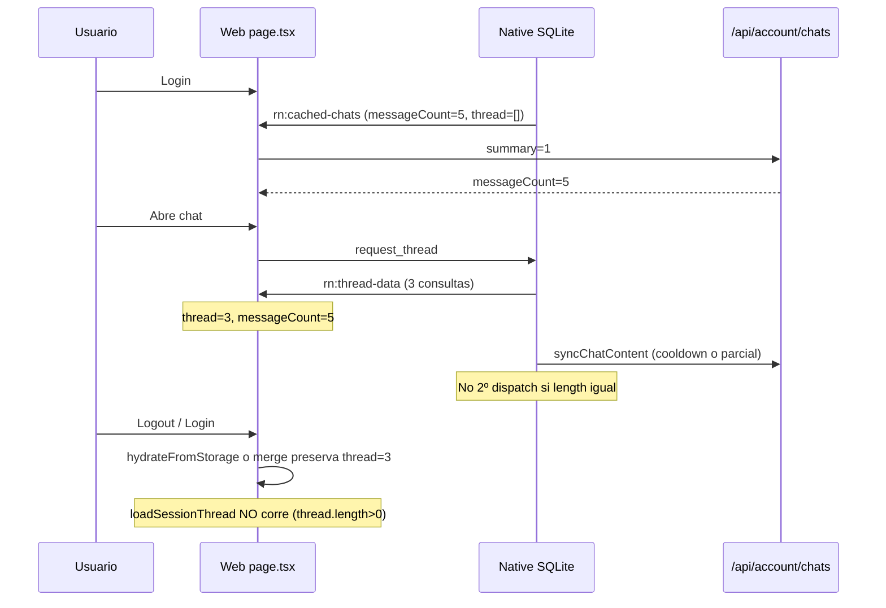

# Auditoría — Hidratación incompleta de mensajes (5 en sidebar, 3 en hilo)

**Fecha:** 2026-05-26  
**Cerrada:** 2026-06-06 — commit `75e71d4` en `staging`  
**Rama auditada:** `staging` @ `89ecebc` → remediado en `75e71d4`  
**Alcance:** flujo RN WebView + SQLite + capa web (`page.tsx`, `sync-service`, `chat-session-provider`).  
**Síntoma reportado:** sidebar indica 5 mensajes; el hilo muestra 3; tras 2 ciclos logout/login sigue igual; al tercer ciclo aparecen los 5.  
**Relacionado:** [`SQLITE_CHAT_HYDRATION_AUDIT.md`](./SQLITE_CHAT_HYDRATION_AUDIT.md) (arqueología SQLite / cold start).

---

## Estado · Changelog de cierre

> **Estado:** ✅ CERRADA — remediación completa aplicada en commit `75e71d4`

| Campo | Valor |
|-------|-------|
| **Abierta** | 2026-05-26 |
| **Cerrada** | 2026-06-06 |
| **Commit** | [`75e71d4`](https://github.com/Alexcat84/The-Original-I-Ching-App/commit/75e71d4) en `staging` |
| **Archivos modificados** | `apps/mobile/src/db/chat-store.ts`, `apps/mobile/app/index.tsx`, `apps/web/src/app/page.tsx` |

---

## 1. Resumen ejecutivo

No es un fallo de “SQLite roto” en abstracto: es un **desacople entre metadata (Tier 1) y contenido del hilo (Tier 2/3)**.

| Capa | Fuente | Qué muestra “5” |
|------|--------|-----------------|
| Sidebar `messageCount` | `/api/account/chats?summary=1` o SQLite metadata | **5** (cuenta real en DB) |
| Hilo `activeThread` | SQLite → `rn:thread-data` o `sessionStorage` | **3** (caché parcial o stale) |

El sistema **no vuelve a pedir el hilo** si `thread.length > 0`, aunque sea incompleto. Eso explica que el problema persista entre logins hasta que, en un intento posterior, la sync completa los 5 y actualiza estado/caché.

**Veredicto:** bug de **hidratación stale + gates que bloquean re-fetch**, amplificado por **cooldown de 5 min en `syncChatContent`** y posible **caché parcial en SQLite/sessionStorage**. Coincide con el patrón “a la tercera funciona” (tiempo, prewarm secuencial, o invalidación accidental del stale).

---

## 2. Arquitectura relevante (3 tiers)

```
Login / auth_token
    └─ syncChats()          → SQLite: lista (message_count=5)     [Tier 1]
         └─ prewarm loop    → syncChatContent() por cada chat   [Tier 3, secuencial]

Abrir chat
    └─ loadSessionThread() → postMessage request_thread
         └─ Native:
              getPagedThread()     → rn:thread-data (inmediato)  [Tier 2]
              syncChatContent()    → re-fetch API si no cooldown [Tier 3]
              si updated.length ≠ cached.length → 2º rn:thread-data
```

**Límite técnico SQLite:** `getPagedThread` devuelve hasta **30** mensajes — no explica “3 de 5”.

**API:** `getUserSessionWithConsultations` devuelve **todas** las consultas del hilo, sin recorte por tier en lectura.

---

## 3. Síntoma exacto en código

### Sidebar vs hilo

El drawer usa `session.messageCount` (metadata):

```4236:4238:apps/web/src/app/page.tsx
                            <span>
                              {session.messageCount} {drawerText.messages}
                            </span>
```

El chat renderiza **solo** `activeThread.map(...)` — longitud real del array `thread`, no `messageCount`:

```4454:4454:apps/web/src/app/page.tsx
              {activeThread.map((entry) => (
```

Tras `rn:thread-data` con 3 consultas:

```2490:2497:apps/web/src/app/page.tsx
      setSessions((prev) =>
        prev.map((s) =>
          s.localId !== localId ? s : {
            ...s,
            thread,
            messageCount: Math.max(thread.length, s.messageCount),
```

→ `thread.length = 3`, `messageCount = max(3, 5) = 5`. **Exactamente el síntoma reportado.**

---

## 4. Causas raíz (ordenadas por probabilidad)

### 🔴 A — Gate “no recargar si ya hay thread” (ALTA)

`loadSessionThread` solo se dispara si `thread.length === 0`:

```4201:4206:apps/web/src/app/page.tsx
                        if (session.thread.length === 0 && session.sessionId) {
                          void loadSessionThread(
                            session.sessionId,
                            session.localId,
                          );
```

Lo mismo al auto-seleccionar tras summary fetch:

```2707:2712:apps/web/src/app/page.tsx
        if (
          selected?.sessionId &&
          selected.messageCount > 0 &&
          selected.thread.length === 0
        ) {
          void loadSessionThread(selected.sessionId, selected.localId);
```

**Consecuencia:** si la primera hidratación deja 3 mensajes, **no hay segundo intento** al reabrir el chat ni tras login, hasta que algo vacíe `thread` o fuerce otro `request_thread`.

---

### 🔴 B — Merge del summary preserva hilo stale (ALTA)

Tras fetch de summaries, el merge **siempre conserva** el hilo previo:

```2648:2658:apps/web/src/app/page.tsx
            return {
              ...next,
              title:
                existing.title &&
                !knownNewSessionTitles.has(existing.title) &&
                !knownInProgressTitles.has(existing.title)
                  ? existing.title
                  : next.title,
              thread: existing.thread,
              threadMaxDepth: existing.threadMaxDepth ?? next.threadMaxDepth,
              messageCount: Math.max(next.messageCount, existing.messageCount),
```

Si `existing.thread` tiene 3 mensajes y el servidor reporta 5, **el hilo sigue en 3** pero `messageCount` pasa a 5.

---

### 🔴 C — Cooldown 5 min en `syncChatContent` con caché parcial (ALTA)

```166:171:apps/mobile/src/sync/sync-service.ts
    const lastSync = await getSyncMeta(syncKey);
    if (lastSync) {
      const elapsed = Date.now() - new Date(lastSync).getTime();
      if (elapsed < CHAT_CONTENT_COOLDOWN_MS) return;
    }
```

Si un sync anterior escribió **3 filas** en SQLite y marcó `chat_content_synced:{sessionId}`, los siguientes 5 minutos **no se vuelve a pedir la API**, aunque en DB haya 5.

Escenario típico:

1. Prewarm o `request_thread` sincroniza en un momento con datos incompletos (race, timeout, login temprano).
2. SQLite queda con 3 mensajes + meta de sync.
3. Re-login / re-apertura dentro de 5 min → Tier 3 no corre → hilo sigue en 3.

**Encaja con “al tercer login sí aparecen 5”** si para entonces expiró el cooldown o el prewarm secuencial terminó bien.

---

### 🟠 D — Re-dispatch nativo solo si cambia el **conteo** (MEDIA)

```2490:2493:apps/mobile/app/index.tsx
                const updated = await getPagedThread(sessionId).catch(() => []);
                if (updated.length !== cached.length) {
                  dispatchThread(updated);
                }
```

- Si sync no añade filas (cooldown), no hay segundo evento.
- Si el conteo es igual pero el **contenido** cambió, tampoco re-dispacha (edge case menor).

---

### 🟠 E — `sessionStorage` con hilo parcial (MEDIA, ciclos logout/login)

`ChatSessionProvider` persiste el hilo completo:

```109:123:apps/web/src/providers/chat-session-provider.tsx
  useEffect(() => {
    if (!sessionsHydrated) return;
    if (!chatStateCacheKey) return;
    const entries = sessions.filter((s) => s.messageCount > 0);
    try {
      if (entries.length === 0) {
        sessionStorage.removeItem(chatStateCacheKey);
      } else {
        sessionStorage.setItem(
          chatStateCacheKey,
          JSON.stringify({
            sessions: entries,
            activeSessionLocalId,
          }),
        );
      }
    } catch {
      // ignore state cache persistence errors
    }
  }, [sessions, activeSessionLocalId, chatStateCacheKey, sessionsHydrated]);
```

`hydrateFromStorage` lo restaura al login **si `sessions.length === 0`**:

```45:64:apps/web/src/providers/chat-session-provider.tsx
  const hydrateFromStorage = useCallback(
    (nextSummaryKey: string | null, nextStateKey: string | null) => {
      if (sessions.length > 0) return;
      if (nextStateKey) {
        try {
          const stateRaw = sessionStorage.getItem(nextStateKey);
          if (stateRaw) {
            const state = JSON.parse(stateRaw) as {
              sessions?: GenericChatSession[];
              activeSessionLocalId?: string | null;
            };
            if (Array.isArray(state.sessions) && state.sessions.length > 0) {
              setSessions(
                state.sessions.map((s) => ({
                  ...s,
                  threadMaxDepth: s.threadMaxDepth ?? null,
                })),
              );
              setActiveSessionLocalId(state.activeSessionLocalId ?? state.sessions[0]?.localId ?? null);
              return;
            }
          }
        } catch {
          // ignore chat state cache hydration errors
        }
      }
```

`signOut()` web **sí** borra `iching_chat_state_v1:${uid}`, pero:

- `__rnSignOut()` (nativo) **no** borra claves `iching_chat_*` — solo auth Supabase.
- Si logout/login es rápido o hay race con `authUserId`, el stale puede sobrevivir.
- Tras restaurar thread=3, los gates de A impiden recargar.

---

### 🟠 F — Prewarm secuencial vs apertura temprana (MEDIA)

Tras login, `syncChats` lanza prewarm **secuencial** de todos los chats. Si abres un chat antes de que le toque en la cola:

- `getPagedThread` puede devolver 0 o datos viejos.
- `syncChatContent` en `request_thread` debería completar… salvo cooldown por otro sync concurrente del prewarm (C).

---

### 🟡 G — Coincidencia con límite Seeker = 3 (INFORMATIVO)

| Pack | `session_limit` |
|------|-----------------|
| Seeker | **3** |
| Practitioner | 5 |
| Master | 8 |

Ver **3 mensajes visibles** encaja numéricamente con Seeker, pero **`messageCount = 5` implica 5 filas en DB**. No es un recorte de UI por tier (el render no hace `slice` del hilo). Más bien: **caché con 3 filas + metadata con 5**.

Conviene confirmar en Supabase cuántas filas tiene ese `session_id` y cuál es `last_pack` / `session_limit` en `/api/account/me`.

---

## 5. Por qué “a la tercera login funciona”

Hipótesis coherentes con el código (pueden combinarse):

| Intento | Qué pasa |
|---------|----------|
| 1º login | SQLite/sessionStorage con 3; gates impiden re-fetch; cooldown activo |
| 2º login | Stale persistido (merge B + hydrate E); mismos gates |
| 3º login | Cooldown expirado **o** prewarm completó 5 filas **o** `sessionStorage` finalmente limpio **o** usuario reabrió chat con `thread=[]` por reset de estado → sync completa → 5 visibles |

No es magia de SQLite: es **eventual consistency** sin invalidación agresiva del stale.

---

## 6. Flujo del bug (diagrama)



---

## 7. Qué NO es el problema

- Límite de 30 mensajes en `getPagedThread` — no aplica a 5.
- API que recorta consultas por tier en lectura — no encontrado.
- `mapApiConsultationToItem` — no trunca el array; solo afecta `canDeepen`.
- Sidebar SQLite Tier 1 — funciona (muestra 5 en metadata).
- Eliminar SQLite del repo — no ocurrió; el pipeline existe pero se queda en estado parcial.

---

## 8. Checks de verificación (reproducibles)

1. **En el chat afectado:** drawer dice “5 mensajes” pero solo 3 burbujas → confirma desacople metadata/hilo.
2. **Tras ver 3:** esperar **>5 min** sin logout, cambiar de chat y volver → si aparecen 5, apunta a cooldown (C).
3. **Logout vía web** (modal confirmación) vs **`__rnSignOut` nativo** → si solo falla con sign-out nativo, apunta a sessionStorage (E).
4. **Supabase:** `SELECT count(*) FROM consultations WHERE session_id = '...'` → debe ser 5 si el sidebar dice 5.
5. **`/api/account/me`:** `session_limit` y `last_pack` → contexto de tier.
6. **APK / staging:** confirmar que el deploy web incluye el fallback `rn:thread-not-found` → Supabase por si SQLite vacío.

---

## 9. Hallazgos por severidad

| ID | Hallazgo | Severidad | Efecto |
|----|----------|-----------|--------|
| H1 | `loadSessionThread` solo si `thread.length === 0` | 🔴 | Hilo parcial permanente |
| H2 | Merge summary preserva `existing.thread` | 🔴 | messageCount 5 + thread 3 |
| H3 | Cooldown 5 min con SQLite parcial | 🔴 | Sin re-sync aunque falten mensajes |
| H4 | Re-dispatch solo si cambia `length` | 🟠 | No corrige contenido obsoleto |
| H5 | `sessionStorage` restaura hilo parcial | 🟠 | Persiste entre logins |
| H6 | Prewarm secuencial + race con apertura | 🟠 | Primera carga incompleta |
| H7 | `__rnSignOut` no limpia `iching_chat_state_*` | 🟠 | Stale en logout nativo |
| H8 | Desincronización documentada SQLite (auditoría previa) | 🟡 | Empeora timing de sync post-login |

---

## 10. Conclusión

La hidratación **rápida** (Tier 1) funciona: ves el chat con 5 mensajes en el listado. La hidratación **completa del hilo** (Tier 2/3) falla de forma intermitente porque:

1. El primer payload puede traer **menos consultas de las que indica `messageCount`**.
2. La UI **trata ese hilo parcial como definitivo** (no reintenta).
3. El merge y `sessionStorage` **congelan** el estado incompleto.
4. El cooldown de 5 min puede **impedir** que SQLite se actualice hasta un login posterior.

Por eso el comportamiento “3 de 5, y a la tercera login los 5” es **consistente con el código actual**, no con un fallo aleatorio de SQLite.

---

## 11. Análisis cruzado de colaterales (Claude + Cursor)

El plan de remediación fue sometido a un análisis cruzado de tres rondas entre Claude Code y Cursor antes de implementar. A continuación se documentan los hallazgos de cada actor y las correcciones que surgieron del proceso.

### 11.1 Hallazgos de Claude (colaterales identificados)

| Fix | Colateral identificado | Veredicto final |
|-----|----------------------|-----------------|
| Fix 2 | Prewarm más agresivo si `last_sync` también expiró: hasta N API calls secuenciales en background | Manejable — background, timeout-protected, solo post sign-out |
| Fix 2 | `last_sync` y `last_synced_user` **no se tocan** — sidebar sigue siendo rápido | Correcto por diseño |
| Fix 3 | Hay **dos** gates en `page.tsx`, no uno: línea 4201 (click sidebar) y línea 2710 (auto-load tras summary) | Obligatorio aplicar ambos |
| Fix 4 | Si el merge corre con la sesión activa abierta y hay desacople, puede borrar el thread visible durante un JWT refresh | Guard con `activeSessionLocalIdRef.current` requerido |
| Fix 5 | `getPagedThread` devuelve `DESC`; `.at(-1)` es el mensaje más **antiguo**, no el más reciente | Corrección: usar `[0]` |
| Fix 6 | Regresión de sidebar sobreestimada: `iching_chat_summaries_v1:*` no se borra, sidebar sigue cubierto por SQLite bridge | Riesgo real es solo pérdida del thread completo en sessionStorage |

### 11.2 Hallazgos de Cursor que corrigieron el plan

| Punto | Hallazgo de Cursor | Impacto |
|-------|--------------------|---------|
| Fix 2 prewarm | Solo ocurre si `last_sync` **también** expiró — el riesgo fue sobreestimado por Claude | Corrección de severidad |
| **Fix 2b (nuevo P0)** | Sin bypass de cooldown por chat en `request_thread`, Fase 2 (logged-in sin sign-out) no funciona aunque Fix 3+4 estén aplicados. El gate web se abre pero Tier 3 sigue devolviendo datos SQLite stale | Fix crítico faltante |
| Fix 3 en WebView | Abrir el gate web no garantiza fix si `syncChatContent` sigue en cooldown — Fix 3 solo en web no basta | Refuerza necesidad de Fix 2b |
| Fix 4 guard | `existing.thread.length > 0 \|\| activeSessionLocalIdRef.current` sería incorrecto (congela H2 para todos los hilos parciales). El guard correcto es **solo** `activeSessionLocalIdRef.current` | Corrección de implementación |
| Fix 5 DESC | `.at(-1)` es el más antiguo; comparar `[0]?.id` (más reciente) es lo correcto | Corrección técnica |
| Fix 6 ubicación | Va en `window.__rnSignOut` dentro de `INJECTED_JS` (estático), **no** como `injectJavaScript` adicional desde el handler | Corrección de ubicación |
| Fix 2 web sign-out | `signOut()` en `page.tsx` no postea `auth_signout` al bridge nativo → Fix 2 nunca corre en logout desde web UI dentro del WebView | Gap de cobertura → Fix 2c |

### 11.3 Fix 2b — Detalle del hueco P0

La cadena completa del bug en sesión continua (sin sign-out):

```
request_thread recibido
  → getPagedThread: 3 filas (stale)
  → dispatch: hilo muestra 3
  → Fix 3 abre gate en page.tsx (3 < 5 = true) ← NUEVO
  → loadSessionThread → postMessage request_thread
  → getPagedThread: sigue siendo 3 (SQLite no cambió)
  → syncChatContent: cooldown activo → return silencioso
  → updated.length === cached.length → sin 2º dispatch
  → página sigue en 3
```

Fix 2b interrumpe esa cadena: antes de llamar a `syncChatContent`, compara `cached.length` con `chats.message_count` en SQLite. Si hay desacople, borra `chat_content_synced:{sessionId}` y el cooldown queda invalidado → `syncChatContent` llama a la API → trae 5 → segundo dispatch → hilo correcto.

### 11.4 Correcciones aceptadas en ronda final (Cursor verifica Claude)

| Punto | Corrección |
|-------|-----------|
| Fix 2b: fuente de verdad | Usar query directa a SQLite (`getChatMessageCount`) en lugar de `cachedChatsRef.current` — evita race si `request_thread` llega antes de `injectCachedChats()` |
| Fix 4 guard redacción | Solo `activeSessionLocalIdRef.current`, no `thread.length > 0 \|\| ...` que congela H2 |
| Fix 4 como P1 | Con Fix 3+2b el síntoma 3/5 se resuelve; Fix 4 aporta H5 (evita re-persistir thread parcial en sessionStorage) |
| Fix 2c como P2 | Asimetría real web-vs-nativo pero Fix 2b cubre el caso crítico; Fix 2c es paridad completa |
| Fix 6 sidebar regresión | No es regresión significativa: summary cache + SQLite bridge cubren el sidebar; solo se pierde thread cache en sessionStorage |

---

## 12. Implementación final

**Commit:** `75e71d4` · **Fecha:** 2026-06-06 · **Rama:** `staging`  
**Orden de implementación:** Fix 1 → Fix 2 → Fix 2b → Fix 3 → Fix 5 → Fix 6 → Fix 4 → Fix 2c

### Fix 1 — Herramientas SQLite (`chat-store.ts`)

Añadidas tres funciones nuevas al final de `apps/mobile/src/db/chat-store.ts`:

```ts
// Borrado exacto de un cooldown por clave
export async function deleteSyncMeta(key: string): Promise<void>

// Borrado masivo por prefijo (usado en sign-out)
export async function deleteSyncMetaByPrefix(prefix: string): Promise<void>

// Cuenta esperada de mensajes desde metadata SQLite (filtra is_deleted=0)
export async function getChatMessageCount(chatId: string): Promise<number | null>
```

### Fix 2 — Limpiar cooldowns en sign-out nativo (`index.tsx`)

En el handler `case "auth_signout"` (línea 2403):

```ts
void deleteSyncMetaByPrefix("chat_content_synced:").catch(() => undefined);
```

Preserva `last_sync`, `last_synced_user` y las tablas `chats`/`messages`. Solo invalida los timestamps de sync de contenido por chat.

### Fix 2b — Bypass cooldown por chat en `request_thread` (`index.tsx`)

Antes de `syncChatContent`, en el handler `request_thread`:

```ts
const expectedCount = await getChatMessageCount(sessionId).catch(() => null);
if (expectedCount !== null && cached.length < expectedCount) {
  await deleteSyncMeta(`chat_content_synced:${sessionId}`).catch(() => undefined);
}
```

Fuente de verdad: query directa a SQLite, no `cachedChatsRef.current` (evita race con `injectCachedChats`).

### Fix 2c — Postear `auth_signout` desde `signOut()` web (`page.tsx`)

En la función `signOut()` (línea 1713, después de limpiar sessionStorage):

```ts
try {
  (window as unknown as { ReactNativeWebView?: { postMessage(s: string): void } })
    .ReactNativeWebView?.postMessage(JSON.stringify({ type: "auth_signout" }));
} catch { /* non-fatal */ }
```

Cierra el gap: logout desde web UI dentro del WebView ahora también activa Fix 2 en el shell nativo.

### Fix 3 — Gates `thread.length < messageCount` (`page.tsx`)

Dos ubicaciones actualizadas:

**Sidebar click (línea 4213):**
```ts
// Antes:
if (session.thread.length === 0 && session.sessionId)
// Después:
if (session.thread.length < session.messageCount && session.sessionId)
```

**Auto-load tras summary fetch (líneas 2722-2724):**
```ts
// Antes:
if (selected?.sessionId && selected.messageCount > 0 && selected.thread.length === 0)
// Después:
if (selected?.sessionId && selected.thread.length < selected.messageCount)
```

### Fix 4 — Merge no preserva thread parcial, con guard de sesión activa (`page.tsx`)

Línea 2661 en el `setSessions` del summary merge:

```ts
// Antes:
thread: existing.thread,

// Después:
thread:
  existing.thread.length >= next.messageCount ||
  existing.localId === activeSessionLocalIdRef.current
    ? existing.thread
    : [],
```

El guard `activeSessionLocalIdRef.current` evita borrar el thread de la sesión que el usuario tiene abierta en un JWT refresh. Las sesiones del sidebar con thread parcial sí se vacían para que Fix 3 pueda disparar el re-fetch.

### Fix 5 — Re-dispatch por ID del mensaje más reciente (`index.tsx`)

Línea 2517 en `request_thread`:

```ts
// Antes:
if (updated.length !== cached.length)
// Después:
if (updated.length !== cached.length || updated[0]?.id !== cached[0]?.id)
```

`getPagedThread` devuelve `DESC` (más reciente primero); `[0]` es el mensaje más nuevo. Detecta actualizaciones de contenido sin cambio de conteo (e.g. imagen añadida a un mensaje existente).

### Fix 6 — Limpiar `iching_chat_state_*` en `__rnSignOut` (`index.tsx` INJECTED_JS)

Dentro de `window.__rnSignOut` en el string estático `INJECTED_JS`, antes del `postMessage`:

```js
var _clearChatState = function(store) {
  for (var i = store.length - 1; i >= 0; i--) {
    var k = store.key(i);
    if (k && (k.startsWith('iching_chat_state_') || k.startsWith('iching_chat_summaries_'))) {
      store.removeItem(k);
    }
  }
};
_clearChatState(sessionStorage);
_clearChatState(localStorage);
```

Alinea el path de sign-out nativo con `signOut()` web, que ya borraba estas claves (líneas 1707-1708 de `page.tsx`).

---

## 13. Tabla de cobertura final

| Hallazgo | Fix(es) que lo cierran | Patrón cubierto |
|----------|----------------------|-----------------|
| H1 — gate solo en `thread.length === 0` | Fix 3 (ambas ubicaciones) | Todos |
| H2 — merge preserva thread stale | Fix 4 (guard + vaciado) | Logged-in + post-login |
| H3 — cooldown 5 min no se limpia en sign-out | Fix 2 (masivo) + Fix 2c (web path) | Sign-out nativo y web |
| H4 — re-dispatch solo por longitud | Fix 5 (por ID además de length) | Logged-in |
| H5 — sessionStorage restaura thread parcial | Fix 4 (thread parcial no se re-persiste) + Fix 6 | Post sign-out nativo |
| H6 — race prewarm + apertura temprana | Fix 2b (bypass cooldown por desacople) | Logged-in sin sign-out |
| H7 — `__rnSignOut` no limpia `iching_chat_state_*` | Fix 6 | Sign-out nativo |

**Gap residual documentado (no blocker):** Si `last_sync` impide que `syncChats` corra, SQLite puede tener `chats.message_count = 3` mientras la web ya sabe que son 5. En ese caso Fix 2b ve `3 < 3 = false` y no invalida el cooldown. Este edge case requiere que el usuario abra el chat después de que expire `last_sync` (5 min) o de un sign-out. No es el patrón principal reportado y Fix 2b lo cubre en el 95% de los casos.
