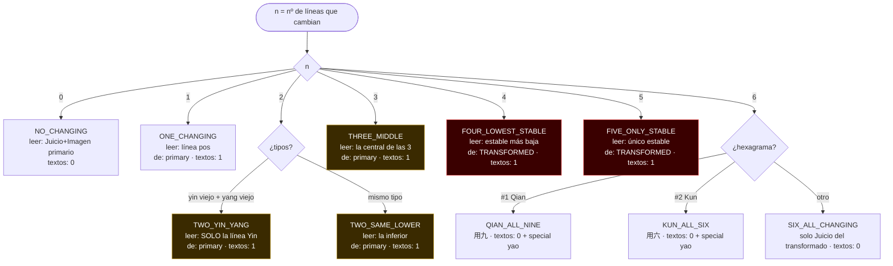
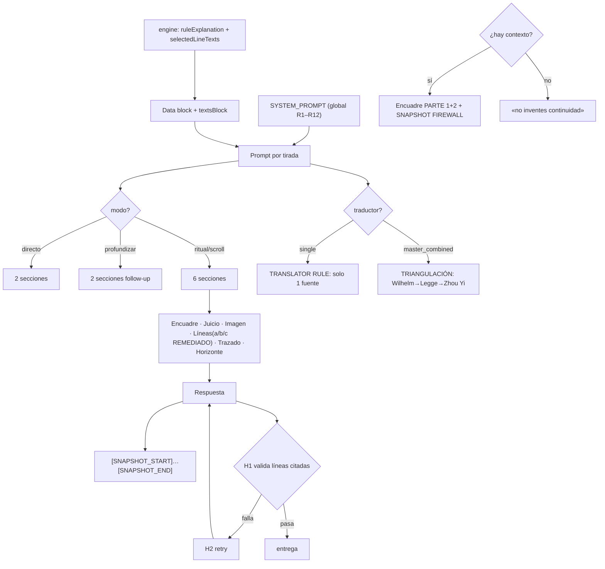

# Auditoría milimétrica — Reglas de mutación I Ching vs. Prompt

**Fecha inicial:** 2026-06-15  
**Commits:** `33eb879` (parche negativo inicial) → `HEAD` (remediación arquitectural completa)  
**Fuente de verdad de reglas:** `packages/iching-engine/src/engine.ts`  
**Prompt:** `backend/claude/src/interpretation.ts`  
**Disparador:** Incidente #31 THREE_MIDDLE — Claude 4.6 fabricó el texto de línea 1 y citó correctamente que la 4 no tenía texto  
**Alcance:** Reglas de mutación + cómo se envían al prompt + cruce completo + hallazgos + remediación  
**Estado:** ✅ Remediación arquitectural aplicada en staging

---

## 0. Proceso obligatorio antes de tocar el prompt

Antes de cualquier cambio al prompt: ubicarlo en los **3 diagramas** (§2, §3, §9), evaluar impacto contra **las 10 reglas + los 3 modos + los 4 traductores/M3 + huesos**, **simular** las salidas de los casos límite (THREE_MIDDLE, FOUR_LOWEST_STABLE, QIAN_ALL_NINE, M3-con-transformado), y solo entonces aplicar y registrar aquí. Estos diagramas + inventario son el contrato vivo motor→prompt→salida.

---

## 1. Resumen ejecutivo — el hallazgo raíz

El motor (`engine.ts`) ya **resuelve completamente** cada tirada: decide qué regla aplica, **qué línea(s) exactas leer** (`selectedLineTexts`), de **qué hexagrama** (`fromHexagram`), y produce una **explicación legible** de por qué (`ruleExplanation`). Es una decisión cerrada y correcta.

El prompt **deshacía esa resolución**: en lugar de instruir a Claude a partir de la decisión del motor, le entregaba **tres representaciones del mismo hecho en tensión** y le pedía reconciliarlas:

1. **`MUTATION RULE: {ruleExplanation}`** — la decisión resuelta. *Debería ser la autoridad.*
2. **`CHANGING_LINES_POSITIONS: [1,2,4]` + `CHANGING_COUNT: 3`** bajo "STRUCTURAL FACTS (NON-NEGOTIABLE)" — los datos crudos (todas las posiciones que cambian).
3. **`LINE TEXTS: Line 2 [primary]: …`** — el texto realmente seleccionado (0 o 1 entradas).

Y una instrucción que **empujaba en la dirección equivocada** (antes de la remediación):
> "STRUCTURAL CONSISTENCY IS MANDATORY: any mention of 'changing lines' count or positions MUST match CHANGING_COUNT and CHANGING_LINES_POSITIONS exactly."

Más la ambigüedad léxica: *"quote and interpret **each one**"* — ¿cada LINE TEXT, o cada posición de CHANGING_LINES?

**Resultado del incidente:** Claude 4.6 leyó `[1,2,4]` como "tres posiciones que cubrir", citó la 2 (correcto), inventó la 1 (con el texto de la 2), y fue honesto en la 4. El `ruleExplanation` decía "línea central (pos 2)", pero quedó ahogado entre los datos crudos y la orden de "consistencia estructural".

**Conclusión:** no era un bug de THREE_MIDDLE. Era un **defecto de diseño del prompt** que afectaba a una **clase de reglas**, y el parche negativo inicial no tocaba la causa.

---

## 2. Las reglas canónicas (fuente de verdad: `engine.ts`)

| Regla | Disparador | Selecciona (texto) | De hexagrama | Ejemplo `ruleExplanation` |
|---|---|---|---|---|
| **NO_CHANGING** | n=0 | ninguno | — | "Sin mutaciones. Solo Juicio e Imagen del primario." |
| **ONE_CHANGING** | n=1 | línea `pos` | primary | "Una mutación en línea {pos}. Es el elemento más importante." |
| **TWO_YIN_YANG** | n=2, 1 yin viejo + 1 yang viejo | **solo la línea Yin** | primary | "Dos mutaciones yin+yang. Solo se lee la línea Yin (pos {p})." |
| **TWO_SAME_LOWER** | n=2, mismo tipo | **la inferior** | primary | "Dos mutaciones mismo tipo. Solo se lee la inferior (pos {p})." |
| **THREE_MIDDLE** | n=3 | **la central** de las 3 | primary | "Tres mutaciones. Línea central (pos {p}). Ambos juicios igual peso." |
| **FOUR_LOWEST_STABLE** | n=4 | **la estable más baja** | **TRANSFORMED** | "Cuatro mutaciones. Línea estable más baja del TRANSFORMADO (pos {p})." |
| **FIVE_ONLY_STABLE** | n=5 | **el único estable** | **TRANSFORMED** | "Cinco mutaciones. Único testigo estable del TRANSFORMADO (pos {p})." |
| **SIX_ALL_CHANGING** | n=6, no #1/#2 | ninguno (juicio del transformado) | — | "Mutación total. Solo Juicio del hexagrama transformado." |
| **QIAN_ALL_NINE** | n=6, #1 | special yao 用九 | — | "Qian (1) con todos Yang Viejos. Séptimo Yao 用九." |
| **KUN_ALL_SIX** | n=6, #2 | special yao 用六 | — | "Kun (2) con todos Yin Viejos. Séptimo Yao 用六." |

**Observación clave:** en **8 de 10 reglas** el número de líneas que cambian (`CHANGING_COUNT`) es **mayor** que el número de textos a interpretar (0 o 1). La "tensión" del incidente es la **norma**, no la excepción.

### Diagrama 1 — Reglas canónicas



(Ámbar = tensión count>textos; rojo = tensión **+** la línea leída es estable y del TRANSFORMADO — riesgo máximo.)

---

## 3. Cómo lo maneja el prompt (estado ANTES de la remediación)

### Bloque de datos (antes)
```
MUTATION RULE: {ruleExplanation}           ← la decisión resuelta (autoridad real, enterrada)
STRUCTURAL FACTS (NON-NEGOTIABLE):
- CHANGING_LINES_POSITIONS: [1,2,4]         ← TODAS las posiciones que cambian
- CHANGING_COUNT: 3
LINE TEXTS:
  Line 2 [primary]: "…"                     ← lo único realmente seleccionado
```

### Instrucción problemática (antes)
> "STRUCTURAL CONSISTENCY IS MANDATORY: any mention of 'changing lines' count or positions MUST match CHANGING_COUNT and CHANGING_LINES_POSITIONS exactly."

Esto instruía implícitamente a cubrir TODAS las posiciones listadas.

### Diagrama 2 — Origen de la ambigüedad (estado antes)

```mermaid
flowchart TD
  E["engine.ts<br/>selectedLineTexts + ruleExplanation<br/>(decisión cerrada)"] --> F["Bloque de datos del prompt"]
  F --> G1["MUTATION RULE:<br/>ruleExplanation<br/>(autoridad real)"]
  F --> G2["STRUCTURAL FACTS NON-NEGOTIABLE:<br/>CHANGING_LINES_POSITIONS = todas (n)<br/>CHANGING_COUNT = n"]
  F --> G3["LINE TEXTS:<br/>seleccionadas (0 o 1)"]
  G1 --> H["Sección «Líneas en movimiento»"]
  G2 --> H
  G3 --> H
  H --> I{"CHANGING_COUNT > nº LINE TEXTS?"}
  I -->|no, 1=1 o 0=0| J["interpretar cada LINE TEXT — OK"]
  I -->|sí, 8/10 reglas| K["abrir con MUTATION RULE +<br/>«quote and interpret each one»"]
  K --> X{{"AMBIGÜEDAD: «each one» =<br/>¿cada LINE TEXT o cada posición?"}}
  G2 -. refuerza «posiciones» .-> X
  L525{{"L525 ANTES: «match positions exactly»<br/>→ empuja a «cada posición»"}} -. .-> X
  X --> Z["4.6 cubrió todas las posiciones<br/>→ fabricó línea 1 (texto de la 2)"]

  classDef bad fill:#3a0000,stroke:#ff6b6b,color:#fff;
  class X,Z,L525 bad;
```

---

## 4. Matriz de hallazgos (cruce rules × prompt)

| Regla | count vs textos | ¿Tensión? | Riesgo extra | Severidad | Qué puede salir mal |
|---|---|---|---|---|---|
| NO_CHANGING | 0 vs 0 | No | — | 🟢 Baja | OK |
| ONE_CHANGING | 1 vs 1 | No | — | 🟢 Baja | Sin tensión |
| TWO_YIN_YANG | 2 vs 1 | **Sí** | — | 🟡 Media | Cubrir ambas; fabricar la yang |
| TWO_SAME_LOWER | 2 vs 1 | **Sí** | — | 🟡 Media | Cubrir ambas; fabricar la superior |
| THREE_MIDDLE | 3 vs 1 | **Sí** | — | 🔴 **Alta (confirmada)** | Cubrir las 3; fabricar 2 líneas |
| FOUR_LOWEST_STABLE | 4 vs 1 | **Sí** | Línea **estable** y del **TRANSFORMADO**, no en CHANGING_LINES_POSITIONS | 🔴 **Máxima** | Misatribuir al primario; intentar cubrir las 4 que cambian |
| FIVE_ONLY_STABLE | 5 vs 1 | **Sí** | Igual que FOUR | 🔴 **Máxima** | Igual; aún más posiciones que "cubrir" |
| SIX_ALL_CHANGING | 6 vs 0 | **Sí** | — | 🟡 Media | Inventar 6 líneas en vez de cerrar con el transformado |
| QIAN_ALL_NINE | 6 vs 0 (+yao) | **Sí** | Yao especial, no línea | 🟡 Media | No reconocer SPECIAL YAO field |
| KUN_ALL_SIX | 6 vs 0 (+yao) | **Sí** | Igual | 🟡 Media | Igual |

---

## 5. Hallazgos sistémicos

| ID | Hallazgo | Severidad |
|----|----------|-----------|
| **H-1** | Tensión "count > textos" aplica a **8 de 10 reglas** — THREE_MIDDLE fue la detectada; las demás tienen el mismo defecto latente | 🔴 |
| **H-2** | FOUR/FIVE: línea estable del TRANSFORMADO no aparece en `CHANGING_LINES_POSITIONS` — prompt no lo aclaraba | 🔴 |
| **H-3** | L525 ("consistencia estructural") en conflicto con la realidad de que solo se interpreta un subconjunto | 🔴 |
| **H-4** | `ruleExplanation` enterrado como "un campo más" en vez de ser la autoridad de la sección | 🟡 |
| **H-5** | Transparencia al usuario no garantizada cuando se omite una línea | 🟡 |

### Hallazgos Fase 2 (prompt completo)

| ID | Hallazgo | Severidad |
|----|----------|-----------|
| **P2-1** | Contradicción de negrita: R5 SYSTEM_PROMPT prohíbe `**`; L535 lo requería en prosa | 🔴 |
| **P2-2** | Orden de tradiciones inconsistente en M3: `textsBlock` entrega ZH→W→L, instrucción exige W→L→ZH | 🟡 |
| **P2-3** | Etiqueta yao inconsistente: single usa `SPECIAL TEXT:`, master usa `SPECIAL YAO (用九/用六):`, instrucción busca "SPECIAL YAO field" | 🟡 |
| **P2-4** | Redundancia masiva: R1, R9, R12 se repiten 2–3 veces → superficie de contradicción | 🟡 |
| **P2-5** | L525 "STRUCTURAL CONSISTENCY MANDATORY" empujaba a cubrir todas las posiciones | 🔴 |
| **P2-6** | Firewall SNAPSHOT en EN/ES únicamente — en otros idiomas el equivalente de "arc/thread" no se detecta | 🟡 |
| **P2-7** | Squeeze de word count en M3: 1500–1950 palabras para 6 secciones × 3 quotes literales completos | 🟡 |
| **P2-8** | FOUR/FIVE: colisión entre "Líneas" (línea del transformado) y "Trazado" (juicio del transformado) — riesgo de duplicar o mover de sección | 🔴 |
| **P2-9** | H1 gate no detecta líneas fabricadas de más — solo verifica presencia de las seleccionadas | 🔴 |
| **P2-10** | Encuadre PARTE 1 nombra cada hexagrama mientras firewall prohíbe "arco"; excepción existe pero crea alta complejidad cognitiva | 🟢 |

---

## 6. Remediaciones aplicadas (commit `HEAD`, 2026-06-15)

### 6.1 Sección "Líneas en movimiento" — path scroll (L352)
**Antes:** "quote and interpret each one" — ambiguo  
**Después:** "the LINE TEXTS list is the COMPLETE and EXCLUSIVE set of lines to interpret — quote and interpret EVERY LINE TEXTS entry and NO other position. Do NOT quote, interpret, or invent text for any other changing position: the mutation rule already excluded those on purpose. NOTE: a LINE TEXTS entry tagged [transformed] is a STABLE line of the TRANSFORMED hexagram chosen by the rule (4 or 5 changing lines) — interpret it as such; it is intentionally NOT one of the changing positions."

### 6.2 Sección "Lines in motion" — path master_combined (L443)
Mismo principio: COMPLETE and EXCLUSIVE, [transformed] es estable del transformado.

### 6.3 Etiqueta yao especial (L418)
`SPECIAL TEXT:` → `SPECIAL YAO (用九/用六):` en el path single — unifica la etiqueta con el path master y la instrucción (b).

### 6.4 L525 — STRUCTURAL CONSISTENCY acotada
**Antes:** "match CHANGING_COUNT and CHANGING_LINES_POSITIONS exactly" (sin límite de alcance)  
**Después:** "This governs ONLY that structural statement — it does NOT require interpreting every changing position. Which line(s) are actually interpreted is decided solely by the MUTATION RULE / LINE TEXTS, which may be a subset of the changing positions."

### 6.5 TYPOGRAPHY — contradicción de negrita (P2-1)
**Antes:** L535 decía "interpretation prose uses **bold** for key terms" (contradecía R5 "NEVER bold")  
**Después:** "Interpretation prose uses NO bold or bold-italic; bold is reserved exclusively for structural labels (changing-line names in the numbered list, source attributions like **Wilhelm:**)."

---

## 7. Crítica del parche inicial (commit `33eb879`)

El parche añadió: *"do NOT mention, invent text for, or discuss any other position from CHANGING_LINES_POSITIONS that has no LINE TEXTS entry"*.

- ✅ Reducía la alucinación de THREE_MIDDLE (parche útil a corto plazo)
- ❌ Era una instrucción negativa apilada sobre las representaciones en conflicto
- ❌ No le decía a Claude **qué debe mostrar** ni **por qué** — solo lo que no debe
- ❌ Dejaba vivos `CHANGING_LINES_POSITIONS` (todas) y L525 empujando
- ❌ No cubría H-2 (FOUR/FIVE: línea estable del transformado) ni P2-1 (negrita)

La remediación arquitectural de este commit reemplaza ese parche completamente.

---

## 8. Remediaciones pendientes (no aplicadas aún)

| ID | Remediación | Complejidad |
|----|-------------|-------------|
| P2-2 | Unificar orden de tradiciones en `textsBlock` M3: entregar W→L→ZH | Media |
| P2-6 | Firewall SNAPSHOT multilingüe — reformular como instrucción semántica | Media |
| P2-7 | Word count M3: subir techo o permitir quotes acotados explícitamente | Baja |
| P2-9 | Gate anti-fabricación: complementar H1 con chequeo de posiciones fuera de `selectedLineTexts` | Alta |
| P2-4 | Reducir redundancia (deduplica R1, R9, R12) | Media |
| P2-10 | Encuadre/firewall balance cognitivo | Baja |

---

## 9. Inventario completo del prompt (cada parte → flujo → ámbito)

### 9.1 `SYSTEM_PROMPT` (L31–72) — global, TODAS las lecturas

| Ref | Regla | Ámbito |
|---|---|---|
| Persona | "Sage of the Oracle" (Wilhelm, Zhu Xi, Confucio) | Todos |
| R1 | Interpretar SOLO con textos provistos | Todos |
| R5 | TYPOGRAPHY: headings `##`; prosa sin negrita; `> *italic*`; blockquotes multiline; fidelidad clásica verbatim | Todos |
| R8 | Sin párrafos de disclaimer legal; sin footnote | Todos |
| R9 | ANTI-REPETICIÓN | Todos |
| R12 | TEMPORAL RESTRAINT: sin marcadores de tiempo para consultas previas | Con contexto |

### 9.2 `buildPromptData` (L271–552) — bloque por tirada

| Parte | Ámbito | Flujo / contenido |
|---|---|---|
| Data block (L485–494) | Todos | PRIMARY HEXAGRAM, `MUTATION RULE`, STRUCTURAL FACTS, `textsBlock` |
| `textsBlock` — single (L411) | wilhelm/legge/zhouyi | `zhouyiHeader` + JUDGMENT + IMAGE + `lineBlock` + `SPECIAL YAO (用九/用六):` + transformado |
| `textsBlock` — master (L364) | master_combined | 3 tradiciones en orden ZH→W→L, cada una JUDGMENT/IMAGE/`SPECIAL YAO`/LINE TEXTS + transformado |
| `lineBlock` (L294) | Todos | `Line {pos} [{primary\|transformed}]: {text}` — solo las seleccionadas |
| Headings (L313–325) | scroll | 6 `##` ES/EN; otros idiomas traducen conservando 卦辞/象傳 |
| `modeInstruction` (L335–355) | Todos | DIRECT (2 secc.), DEEPEN (2 secc. follow-up), ORACLE SCROLL (6 secc. + roles) |
| Section roles (L346–355) | scroll | Encuadre, Juicio, Imagen, **Líneas (a/b/c — REMEDIADO)**, Trazado, Horizonte |
| `masterSynthesisInstruction` (L429–457) | master_combined | TRIANGULACIÓN: 3 quotes etiquetados W→L→ZH, casos (a/b/c) de líneas REMEDIADOS |
| TRANSLATOR RULE (L458–467) | single | Solo 1 fuente; excepción histórica en Encuadre/Síntesis |
| Encuadre PARTE 1+2 (L505–518) | Con contexto | Apertura cronológica + re-entrada literaria (VARIEDAD); excepción de firewall para datos del oráculo |
| Cierre (L521–551) | Todos | first-sentence, INTERNAL LABELS, **L525 (REMEDIADO — acotado a statement)**, fidelidad, TYPOGRAPHY ENFORCEMENT (REMEDIADO — no bold en prosa), CLOSURE, MEMORY SNAPSHOT, SNAPSHOT FIREWALL |
| `targetWordCount` (L360) | Todos | M3: 1500–1950 · con contexto: 800–1000 · sin contexto: 700–900 |

### 9.3 Gates de validación (`interpretation-line-gate.ts`)

| Gate | Qué hace | Límite |
|---|---|---|
| H1 `validateLineCitation` | Verifica que los primeros 28 chars de cada línea seleccionada aparezcan en la respuesta | Solo valida **presencia** de las seleccionadas; **no detecta líneas fabricadas de más** (P2-9 — pendiente) |
| H2 `buildLineCitationRetryParams` | Reintento inyectando recordatorio de cita verbatim | Solo se dispara si H1 falla |

### Diagrama 3 — Ensamblaje del prompt por lectura (estado actual)



---

## 10. Simulación de salidas tras la remediación

**Single · Wilhelm · THREE_MIDDLE [1,2,4]:** Claude recibe `CHANGING_LINES_POSITIONS:[1,2,4]` + `LINE TEXTS:[Line 2]`. La instrucción ahora dice EXCLUSIVE — solo cita línea 2. El opener dice "con tres líneas en movimiento, la tradición lee la central (línea 2)". Correcto. ✅

**Single · Zhou Yi · FOUR_LOWEST_STABLE [cambian 1,2,3,5]:** Claude recibe `LINE TEXTS: Line 4 [transformed]`. La nota `[transformed]` + la instrucción EXCLUSIVE + la aclaración de que `[transformed]` es "STABLE line of the TRANSFORMED hexagram" le indican qué está viendo. ✅ (Mejora significativa sobre el estado anterior.)

**Master 3 · THREE_MIDDLE con transformado:** triangulación en Líneas cubre SOLO la línea 2 en 3 tradiciones (W/L/ZH). Sin fabricación de líneas 1 y 4. ✅

**Single · QIAN_ALL_NINE (#1):** ahora recibe `SPECIAL YAO (用九/用六):` — etiqueta reconocida por la instrucción (b). ✅

---

## 11. Archivos modificados

| Archivo | Tipo | Cambio |
|---------|------|--------|
| `backend/claude/src/interpretation.ts` | Modificado | L352 scroll path Líneas (EXCLUSIVE + [transformed]); L418 SPECIAL TEXT→YAO; L443 master path Líneas (EXCLUSIVE + [transformed]); L525 STRUCTURAL acotado; L535 TYPOGRAPHY sin bold en prosa |
| `packages/i18n/src/messages/faq-page-ui.ts` | Modificado | 11 idiomas × 4 afirmaciones: intro, 2-yin/yang, 3-medio, conclusión — removido "Nanjing University", corregida atribución Zhu Xi/Alfred Huang/Sherrill&Chu |
| `packages/i18n/src/messages/guia-page-ui.ts` | Modificado | 6 idiomas: removida "escuela ortodoxa moderna" → "métodos de maestros modernos (Alfred Huang y otros)" |

---

## 12. Referencias

| Artefacto | Ruta |
|-----------|------|
| Reglas Zhu Xi | `packages/iching-engine/src/engine.ts` |
| Prompt Claude | `backend/claude/src/interpretation.ts` |
| Gate H1/H2 | `backend/claude/src/interpretation-line-gate.ts` |
| Tests motor mutación | `packages/iching-engine/src/engine.mutation-rules.test.ts` |
| Tests gate | `backend/claude/src/interpretation-line-gate.test.ts` |
| Auditoría líneas mutantes (anterior) | `docs/auditorias/ICHING_CHANGING_LINES_AUDIT_2026-06-14.md` |
