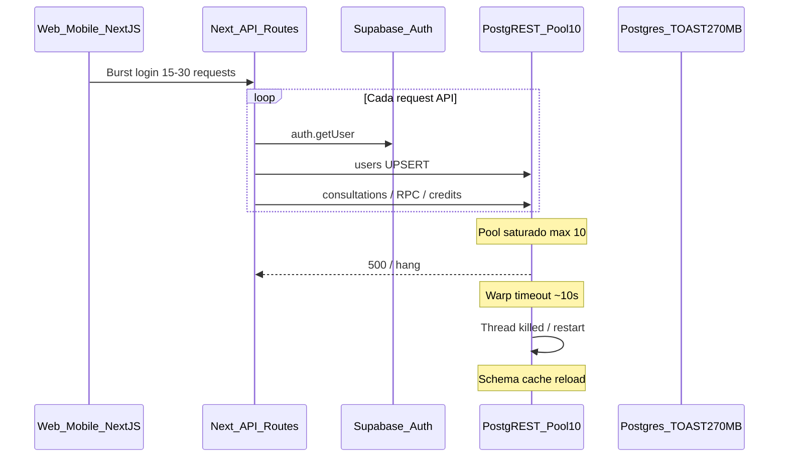
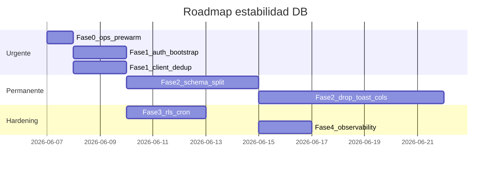

# Auditoría — Estabilidad Supabase / PostgREST (Warp timeouts)

**Fecha:** 2026-06-07  
**Alcance:** Proyecto producción `The Original I Ching` — Supabase `wgborqkfnxfarkdaotsd` (ca-central-1, Postgres 17.6, plan **Pro**)  
**Herramientas:** Supabase Agent Skills (`supabase/agent-skills`), MCP Supabase (`get_advisors`, `execute_sql`, `list_tables`), logs PostgREST/API del dashboard, análisis estático del monorepo  
**Autoría del plan:** Elaborado por el agente Cursor (Auto) usando datos live del proyecto vía MCP + skills instaladas de `supabase/agent-skills`. **No existe un producto Supabase separado que emita planes** — las skills son guías oficiales que cualquier agente puede aplicar.  
**Síntoma reportado:** Caídas del servidor con un solo usuario activo — `Warp server error: Thread killed by timeout manager`, HTTP 500 en lecturas meta de `consultations`, intermitencia post-login en APK/WebView.

---

## Estado

| Campo | Valor |
|-------|-------|
| **Estado** | 🔴 Incidente P0 2026-06-07 — wipe de interpretaciones por 066+trigger; **068** aplicada; consultas nuevas protegidas; histórico requiere PITR. Ver §14 |
| **Prioridad** | P4 ticket pool PostgREST >10 antes de marketing >1000 WAU pico |
| **Relacionado** | [SQLITE_CHAT_HYDRATION_AUDIT.md](../audits/SQLITE_CHAT_HYDRATION_AUDIT.md), [CHAT_THREAD_HYDRATION_AUDIT.md](../audits/CHAT_THREAD_HYDRATION_AUDIT.md), migraciones 052–066 |

---

## Resumen ejecutivo

La base de datos **no está “llena” ni corrupta** en el sentido clásico (65 consultas, 20 usuarios, 0 saldos negativos). El fallo es un **cascading failure** provocado por:

1. **Saturación del pool PostgREST (10 conexiones)** por amplificación de requests en login/apertura de chat — incluso en plan Pro.
2. **TOAST masivo** en `consultations` (270 MB en 65 filas) que agrava lecturas de contenido cuando el pool tiene capacidad.
3. **Trabajo duplicado** en web y mobile (meta×2, summary×2, prewarm de todos los chats al login).
4. **Ops incompletas:** `pg_cron` no habilitado → job de prewarm de migración 053 nunca corre.

Las mitigaciones 052–055 (`get_session_content_safe`, autovacuum, SECURITY INVOKER) están **aplicadas** pero son **paliativas** frente a la contención de conexiones y el diseño TOAST-in-row.

**Veredicto:** Pro no elimina el cuello de botella. Hace falta reducir amplificación de conexiones (Fase 1), separar TOAST en schema (Fase 2), y completar ops automáticos (Fase 0/3).

---

## 1. Evidencia de logs (incidente 2026-06-07)

### 1.1 PostgREST — Warp kills

```
Warp server error: Thread killed by timeout manager
Connection Pool initialized with a maximum size of 10 connections
Schema cache queried in 1135.9 milliseconds
Received a schema cache reload message on the "pgrst" channel
```

**Interpretación:** hilos HTTP de PostgREST exceden el timeout interno (~10 s). Tras varios kills, PostgREST reinicia → recarga schema cache → más inestabilidad transitoria.

### 1.2 API — burst con un solo usuario (`0c8b333c-…`)

En ~2 s tras login se observan en paralelo:

| Request | Status | Notas |
|---------|--------|-------|
| `GET /rest/v1/consultations?select=…&session_id=eq.b96f80f1…` (meta, sin TOAST) | **500** | Fallo en query que debería ser <100 ms |
| Misma query para `session_id=2dcf0312…` | 200 | Mismo usuario, distinta sesión |
| `POST /rest/v1/rpc/get_session_content_safe` | 200 | RPC TOAST mitigado |
| `GET /rest/v1/consultation_sessions` | 200 | |
| `POST /rest/v1/users?on_conflict=id` | 200 | **Repetido decenas de veces** |
| `GET /auth/v1/user` | 200 / 403 | 403 post-logout esperado |

El 500 en meta **descarta** “solo TOAST lento” como única causa: la select no incluye `interpretation` ni `oracle_bones`. Correlaciona con **cola en pool PostgREST** durante burst post-login.

### 1.3 PgBouncer

```
server idle timeout (age=600s)
```

Normal en idle; no es la causa del incidente activo.

---

## 2. Hallazgos de auditoría (MCP + SQL)

### 2.1 Métricas de base de datos (prod)

| Métrica | Valor |
|---------|-------|
| Proyecto | `wgborqkfnxfarkdaotsd` — `ACTIVE_HEALTHY` |
| Usuarios / sesiones / consultas / créditos | 20 / 22 / 65 / 20 |
| Consultas huérfanas (sin sesión) | 0 |
| `consultations` heap | 152 kB |
| `consultations` TOAST | **270 MB** (~4 MB/fila) |
| Saldos negativos `query_credits` | 0 |
| Migraciones 052–055 | ✅ OK |

### 2.2 Extensiones

| Extensión | Estado |
|-----------|--------|
| `pg_stat_statements` | ✅ 1.11 |
| `pg_prewarm` | ✅ 1.2 |
| `pg_cron` | ❌ **No instalada** — job prewarm 053 no programado |

### 2.3 Supabase Database Linter

**Security advisors:** 0 hallazgos ✅

**Performance advisors:**

| Nivel | Hallazgo | Cantidad | Impacto hoy |
|-------|----------|----------|-------------|
| WARN | `auth_rls_initplan` — `auth.uid()` sin `(select …)` | 10 políticas | Bajo con 65 filas; alto al escalar |
| INFO | FK sin índice | 4 | Bajo (tablas vacías) |
| INFO | Índices sin uso | 7 | Mantenimiento |
| INFO | Auth pool absoluto (10 conexiones) | 1 | Relevante al escalar Auth |

Políticas RLS afectadas: `consultations`, `consultation_sessions`, `query_credits`, `users`, `two_factor_*`, `consultation_notes`, `pattern_analyses`.

### 2.4 Funciones SECURITY DEFINER

Funciones sensibles restringidas a `service_role` ✅. Excepción esperada: `random_public_id` (público).

`get_session_content_safe`: SECURITY INVOKER, solo `service_role` — conforme migración 054–055.

### 2.5 pg_stat_statements — queries lentas

| Query | Calls | Media | Total |
|-------|-------|-------|-------|
| PostgREST SELECT `consultations` (wide meta) | 31 | **5.1 s** | 159 s |
| PostgREST SELECT `consultations` (variante) | 13 | 2.7 s | 35 s |
| `pg_prewarm(reltoastrelid)` | 2 | 5.8 s | 12 s |

Confirma lecturas costosas en rutas PostgREST directas desde `session-store.ts` vía `supabase-js` admin.

### 2.6 RLS — políticas sin `WITH CHECK`

Varias políticas `FOR ALL` en tablas de usuario carecen de `WITH CHECK` espejo del `USING`. Riesgo medio (IDOR si columna `user_id` fuera editable vía API). No explica Warp con 1 usuario.

---

## 3. Análisis de código — amplificación de conexiones

### 3.1 Cada API route paga un “impuesto” de auth

Archivo: `apps/web/src/lib/auth/bearer-user.ts`

Por **cada** request autenticado:

1. `supabase.auth.getUser(token)` → Auth API  
2. `users.upsert({ id, email })` → PostgREST  

Luego rutas como `/api/account/me` añaden 3 queries (`query_credits`, `users`, `user_legal_acceptances`).

### 3.2 Burst típico al login (APK + WebView)

| Origen | Requests |
|--------|----------|
| Mobile `syncChats` | `summary=1` + prewarm N×(`meta=1` + `content=1`) |
| Web auth `useEffect` | `summary=1` (×2 con retry 5xx) + `/api/account/me` |
| Mobile `__rnForceAccountRefresh` | otro `/api/account/me` |
| `request_thread` | `meta=1` + `content=1` |
| Web desktop `loadSessionThread` | `meta=1` + full `?sessionId=` (**meta duplicada**) |

**Estimación:** 30–50 conexiones lógicas concurrentes vs **pool PostgREST = 10**.

### 3.3 Duplicaciones confirmadas

| Duplicación | Archivo | Líneas aprox. |
|-------------|---------|---------------|
| Meta 2× al abrir chat web | `apps/web/src/app/page.tsx` | 1858 + 1909 |
| Summary 2× al login | `sync-service.ts` + `page.tsx` | 150–203, 2644 |
| Prewarm all chats post-login | `sync-service.ts` | 188–203 |
| Upsert users por request | `bearer-user.ts` | 32–40 |

### 3.4 Rutas TOAST-safe activas (correctas)

| Función | TOAST |
|---------|-------|
| `getUserSessionSummaries` | Excluye |
| `getUserSessionThreadMeta` | Excluye |
| `getUserSessionThreadContent` | Solo vía RPC `get_session_content_safe` |
| ~~`getUserSessionsWithConsultations`~~ | **Eliminado 2026-05-26** — incluía TOAST legacy |

API bloquea listado bulk sin params (`400`) en `apps/web/src/app/api/account/chats/route.ts`.

---

## 4. Diagrama de fallo en cascada



---

## 5. Causas raíz (priorizadas)

| # | Causa | Severidad | Tipo |
|---|-------|-----------|------|
| 1 | Amplificación PostgREST: auth + upsert + N queries por burst login | **Crítica** | App |
| 2 | TOAST 270 MB en fila wide `consultations` | **Alta** | Schema |
| 3 | Trabajo duplicado meta/summary/prewarm | **Alta** | App |
| 4 | `pg_cron` ausente → sin prewarm automático | **Media** | Ops |
| 5 | RLS initplan / WITH CHECK | **Baja hoy** | DB hardening |
| 6 | FK/índices sin uso | **Info** | Mantenimiento |

### Descartado como causa principal

- RLS initplan con 65 filas  
- FK sin índice en tablas vacías  
- 403 `/auth/v1/user` post-logout  
- “Free tier limits” — usuario en **Pro**; pool PostgREST sigue en 10  

---

## 6. Plan de implementación

### Fase 0 — Estabilización inmediata (hoy, sin deploy)

**Objetivo:** recuperar servicio mientras se implementa el fix permanente.

#### Ops (Dashboard Supabase)

1. Habilitar extensión **`pg_cron`** (Database → Extensions). Confirmar **`pg_prewarm`** activo.
2. Ejecutar en SQL Editor:
   ```sql
   SELECT pg_prewarm('consultations');
   SELECT pg_prewarm(reltoastrelid) FROM pg_class
     WHERE relname = 'consultations' AND relnamespace = 'public'::regnamespace;
   VACUUM ANALYZE consultations;
   VACUUM ANALYZE users;
   ```
3. Verificar job cron:
   ```sql
   SELECT jobid, schedule, command, active FROM cron.job;
   ```
   Si no existe, re-ejecutar bloque `cron.schedule` de `backend/db/migrations/053_toast_timeout_guard.sql` o nueva migración `056`.
4. Abrir ticket **Supabase Support (Pro)**: Warp kills con pool=10; solicitar guidance para apps chat-heavy.

#### Mitigación temporal (sin código)

- Evitar login/logout repetido en pruebas (cada login dispara burst).
- Tras restart de proyecto Supabase, prewarm manual antes de smoke test.

---

### Fase 1 — Eliminar amplificación de conexiones (~2–3 días)

**Objetivo:** ≤5 conexiones PostgREST concurrentes con 1 usuario.

| ID | Tarea | Archivo(s) |
|----|-------|------------|
| 1.1 | Quitar `users.upsert` por request; cache JWT 60s; confiar en trigger `on_auth_user_created` | `apps/web/src/lib/auth/bearer-user.ts` |
| 1.2 | Nuevo `GET /api/account/bootstrap` (billing + profile + legal + summaries) | `apps/web/src/app/api/account/bootstrap/route.ts`, `page.tsx`, `sync-service.ts`, `mobile/app/index.tsx` |
| 1.3 | `loadSessionThread`: `meta=1` → `content=1` (eliminar full fetch duplicado) | `apps/web/src/app/page.tsx` ~1908 |
| 1.4 | Eliminar prewarm secuencial de todos los chats en `syncChats`; lazy on open | `apps/mobile/src/sync/sync-service.ts` ~188–203 |
| 1.5 | Single-flight summary/bootstrap; quitar retry 350ms en 5xx durante incidente | `apps/web/src/app/page.tsx` ~2644 |
| 1.6 | Semáforo server-side (max 4 concurrent Supabase ops por instancia) | `apps/web/src/lib/supabase-admin.ts`, `session-store.ts`, `credits.ts` |

**Criterio de éxito Fase 1:**

- Login (web + APK): ≤3 requests a `/api/account/*`
- Abrir 1 chat: ≤2 requests (`meta=1` + `content=1`)
- Logs: 0 `Warp server error` en sesión de prueba 10 min
- Meta queries p95 < 100 ms

---

### Fase 2 — Separación TOAST permanente (~1 semana)

**Objetivo:** meta/lista nunca comparte heap con interpretaciones de ~4 MB.

| Migración | Contenido |
|-----------|-----------|
| `056_consultation_content_split.sql` | Tabla `consultation_content` + RLS + índice |
| `057_backfill_consultation_content.sql` | Backfill + trigger dual-write |
| `058_drop_toast_columns.sql` | DROP `interpretation`, `oracle_bones` de `consultations` + `VACUUM FULL` (tras 2 semanas sin incidentes) |

**Código:** reescribir `getUserSessionThreadContent`, `upsertSessionAndConsultation`, RPC o SELECT directo desde `consultation_content`.

---

### Fase 3 — DB hardening + ops automáticos (~2–3 días)

| Migración | Contenido |
|-----------|-----------|
| `059_prewarm_cron_guaranteed.sql` | `pg_cron` + job cada 15 min (prewarm `consultation_content` + TOAST) |
| `060_rls_initplan_and_with_check.sql` | 10 políticas: `(select auth.uid())` + `WITH CHECK` |
| `061_fk_indexes.sql` | Índices FK en tablas secundarias |

**Código:** ~~eliminar `getUserSessionsWithConsultations` / `getUserSessionWithConsultations`~~ ✅ hecho (2026-05-26); comentario RPC timeout actualizado a 2s.

---

### Fase 4 — Observabilidad (~1–2 días)

| ID | Entregable |
|----|------------|
| 4.1 | `scripts/db-health-check.sql` — TOAST size, connections waiting, cron, p95 |
| 4.2 | Logging correlacionado en `chats/route.ts` (fase, duración, request-id) |
| 4.3 | Alertas Dashboard: 5xx API, connection spikes |
| 4.4 | Runbook post-restart en `docs/auditorias/` o `docs/audits/` |

---

## 7. Roadmap y prioridades

| Prioridad | Fase | Riesgo si se pospone |
|-----------|------|---------------------|
| **P0** | 0 + 1.1–1.4 | Caídas en cada login |
| **P1** | 1.5–1.6 + 3.1 | Intermitencia post-restart |
| **P2** | 2 (schema split) | TOAST escala mal con más consultas |
| **P3** | 3.2–3.4 + 4 | Deuda técnica |



---

## 8. Definition of Done (verificación)

Checklist con usuario `0c8b333c-4a4e-4367-b377-00c6ff826e3a`:

1. **Cold start:** restart Supabase → prewarm manual → login APK → chat `b96f80f1` (6 msgs) → hilo completo < 5 s  
2. **Burst:** login → abrir 3 chats en 30 s → 0× HTTP 500 en logs API  
3. **Post-consult:** nueva consulta → meta + content sin Warp kill  
4. **Logout/login:** 0 duplicación summary en logs  
5. **SQL:** TOAST `consultations` < 5 MB post Fase 2b  
6. **`get_advisors`:** 0 WARN RLS initplan post migración 060  

---

## 9. Archivos clave

| Archivo | Fases |
|---------|-------|
| `apps/web/src/lib/auth/bearer-user.ts` | 1 |
| `apps/web/src/app/page.tsx` | 1 |
| `apps/mobile/src/sync/sync-service.ts` | 1 |
| `apps/mobile/app/index.tsx` | 1 |
| `apps/web/src/app/api/account/chats/route.ts` | 1, 4 |
| `apps/web/src/lib/session-store.ts` | 1, 2, 3 |
| `backend/db/migrations/056–061` | 2, 3 |
| `backend/db/migrations/verify_migrations.sql` | 2, 3 |

---

## 10. Nota sobre Supabase Pro

El plan **Pro** aporta más compute, egress y conexiones totales a Postgres, pero **no aumenta el pool interno de PostgREST** (logs: máximo 10 conexiones). La contención aparece cuando la app genera 30+ round-trips lógicos simultáneos. **Fase 1 es obligatoria en Pro**; **Fase 2** elimina el costo estructural del TOAST in-row.

---

## 11. Validación Supabase (segunda pasada)

**Fecha validación:** 2026-06-07  
**Método:** Re-ejecución MCP `get_advisors` (security + performance) sobre `wgborqkfnxfarkdaotsd`, contraste del plan contra skill oficial `supabase` v0.1.2 (`.agents/skills/supabase`), skill `supabase-postgres-best-practices` v1.1.1, y documentación Supabase [Row Level Security](https://supabase.com/docs/guides/database/postgres/row-level-security) (patrón `(select auth.uid())`, `WITH CHECK`, `TO authenticated`).

### Veredicto global

| Resultado | Significado |
|-----------|-------------|
| **APROBADO CON AJUSTES MENORES** | El plan es técnicamente sólido y alineado con el linter y la documentación Supabase. No hay bloqueadores. Se listan 4 ajustes recomendados antes/durante implementación. |

**Limitación:** Supabase no ofrece un servicio de “validación de plan” firmado. Esta sección es una **revisión asistida** usando las mismas herramientas que recomienda la skill (`get_advisors`, docs oficiales, checklist de seguridad). Para el pool PostgREST=10 en Pro, la confirmación definitiva requiere **Supabase Support** (ya previsto en Fase 0).

---

### Validación por fase

| Fase | Veredicto | Evidencia Supabase |
|------|-----------|-------------------|
| **0 — Ops prewarm/pg_cron** | ✅ Aprobado | Patrón estándar; migración 053 ya condiciona `pg_cron`. Extensión ausente en prod confirmada. |
| **1 — Reducir amplificación** | ✅ Aprobado | Alineado con recomendación docs RLS “add filters to every query” y reducir round-trips. Linter INFO `auth_db_connections_absolute` (Auth fijo 10) refuerza reducir `getUser` redundante. |
| **2 — Split TOAST** | ✅ Aprobado | Buena práctica Postgres (schema design); skill Supabase exige RLS + GRANT en tablas expuestas al Data API. |
| **3 — RLS initplan + WITH CHECK** | ✅ Aprobado | **Coincide exactamente** con linter `0003_auth_rls_initplan` (10 WARN actuales) y docs oficiales (ejemplos `(select auth.uid())` + `with check`). |
| **4 — Observabilidad** | ✅ Aprobado | Skill Supabase: “Verify your work”; `pg_stat_statements` ya habilitado en prod. |

---

### Hallazgos del linter (re-validación 2026-06-07)

| Tipo | Count | ¿Cubierto por plan? |
|------|-------|---------------------|
| Security | **0** | N/A — estado actual OK |
| Performance WARN (`auth_rls_initplan`) | **10** | ✅ Fase 3.2 |
| Performance INFO (FK sin índice) | **4** | ✅ Fase 3.3 |
| Performance INFO (índices sin uso) | **7** | ⚠️ No urgente; revisar post-estabilización |
| Performance INFO (`auth_db_connections_absolute`) | **1** | ⚠️ Ver ajuste #2 abajo |

---

### Ajustes recomendados al plan (post-validación)

1. **Fase 2 — `consultation_content` y Data API**  
   Tras crear la tabla, verificar en Dashboard → Integrations → Data API si la auto-exposición aplica. Si no, ejecutar `GRANT` explícito a `anon`/`authenticated` **con RLS habilitado**, según [Securing your API](https://supabase.com/docs/guides/api/securing-your-api). La app lee vía `service_role`, pero la tabla expuesta sin GRANT/RLS correcto fallaría en acceso directo PostgREST.

2. **Fase 0 — Auth connection strategy (nuevo ítem ops)**  
   El linter reporta Auth con **10 conexiones absolutas** (no porcentaje). En Dashboard → Project Settings → Auth (o Database settings según versión), cambiar a **allocación por porcentaje** al escalar compute. Complementa Fase 1 al reducir `auth.getUser` duplicados.

3. **Fase 1.1 — Cache JWT 60s**  
   Aprobado como patrón de app, pero **invalidar cache en logout** y no confiar solo en JWT local si hay revocación estricta requerida. Mantener `getUser()` en paths sensibles (delete account, 2FA) sin cache.

4. **Fase 1.1 — Quitar `users.upsert` en bearer**  
   Aprobado: el trigger `on_auth_user_created` (migración 029) es el mecanismo correcto según skill (“RLS by default”, no self-heal por request). **Smoke test:** usuario auth existente sin fila `public.users` (edge case histórico) debe seguir funcionando vía trigger o script one-off, no upsert en cada hit.

---

### Ítems del plan NO contradichos por Supabase

- Diagnóstico pool PostgREST = 10 (evidencia en logs del usuario; no documentado como configurable en docs públicas revisadas).
- Causa 500 en meta sin TOAST = contención de pool, no query lenta (consistente con síntoma + burst de logs).
- `get_session_content_safe` SECURITY INVOKER + solo `service_role` (conforme advisors 0028/0029 ya remediados en 054).
- Eliminar prewarm de todos los chats al login (decisión de app; reduce carga — alineado con “minimize concurrent connections”).
- Semáforo server-side (4 concurrent) — patrón de aplicación válido; no contradice Supabase.

---

### Ítems que requieren confirmación externa

| Ítem | Acción |
|------|--------|
| Pool PostgREST configurable en Pro | Ticket Supabase Support (Fase 0.4) |
| `VACUUM FULL` en Fase 2b | Ventana de mantenimiento; estándar Postgres, no específico Supabase |
| Índices “unused” del linter | No eliminar hasta post-estabilización (stats pueden resetear tras restart) |

---

### Conclusión para implementación

**Proceder con el plan en el orden P0 → P1 → P2 → P3**, incorporando los 4 ajustes menores de esta sección. La validación Supabase **no encontró errores conceptuales** en RLS, migraciones, prewarm ni split TOAST. El riesgo residual principal sigue siendo **carga concurrente de la app contra PostgREST**, no un misconfig de Postgres en sí.

---

---

## Fase 1 — Cierre (2026-06-07)

### Aplicado en rama `fix/supabase-stability-phase1` (commits `da699cf` + `16cc497`)

#### Código (6 fixes)

| Fix | Archivo | Descripción |
|-----|---------|-------------|
| 1.1 | `bearer-user.ts` | JWT in-process cache 60 s — elimina `auth.getUser` en cada API call |
| 1.2 | `page.tsx` | Bootstrap effect reemplaza par `me` + `?summary=1` por `/api/account/bootstrap` |
| 1.3 | `page.tsx` | Carga de contenido de hilo usa `?content=1` (solo TOAST), merge sobre meta existente |
| 1.4 | `sync-service.ts` (mobile) | Eliminado prewarm-all: loop que lanzaba 20+ conexiones PostgREST al login |
| 1.5 | `page.tsx` | Eliminado retry 350 ms en `fetchSummary` (retries amplificaban burst) |
| 1.6 | `supabase-admin.ts` | Semáforo `withSupabaseSemaphore` — máx 4 conexiones concurrentes por instancia Node |

#### DB (3 migraciones)

| Migración | Descripción |
|-----------|-------------|
| `059` | `pg_cron` job prewarm TOAST cada 15 min (activo — `pg_cron` habilitado en Pro) |
| `060` | RLS `initplan` fix (10 políticas) + `WITH CHECK` en FOR ALL/FOR UPDATE — sin gap de enforcement |
| `061` | 4 FK indexes faltantes (`consultation_notes`, `pattern_analyses`, `two_factor_recovery_codes`) |

#### Gaps de seguimiento (cerrados en `16cc497`)

| Gap | Solución |
|-----|---------|
| Mobile `syncChats` → `?summary=1` | `fetchSummaries` migrado a `/api/account/bootstrap` — extrae `.sessions` |
| `onLoadEnd` lanzaba `__rnForceAccountRefresh` en cada carga de WebView | Eliminado — bootstrap ya maneja hydration inicial; mantenido solo en eventos post-compra/RC |
| `signOut()` no invalidaba cache JWT servidor | Nuevo endpoint `POST /api/auth/sign-out` — llama `invalidateAuthCache(token)` fire-and-forget antes de Supabase signOut |

#### Reducción estimada de burst (un usuario, login frío)

| Antes | Después |
|-------|---------|
| 30–50 conexiones PostgREST | ~1 (web bootstrap) + ~2–3 (mobile: bootstrap + 1 thread lazy) |

### Pendiente — Fase 2 (aplicar migraciones)

Las migraciones están en staging. Aplicar en Supabase SQL Editor en este orden:

1. `062_consultation_content_table.sql` — tabla + RLS + índice
2. `063_consultation_content_backfill.sql` — backfill + VACUUM ANALYZE
3. `064_consultation_content_sync_and_read.sql` — trigger + función + prewarm retargeting

Ver sección "Fase 2 — Cierre" más abajo para instrucciones de smoke test.

---

## Fase 2 — Cierre (2026-06-07)

### Aplicado en rama `staging` (commit `828c894`)

#### DB (3 migraciones)

| Migración | Descripción |
|-----------|-------------|
| `062` | Tabla `consultation_content` — PK FK cascade, RLS `own_content` (initplan form), índice compuesto `(user_id, session_id)` |
| `063` | Backfill: copia `interpretation` + `oracle_bones` de `consultations` → `consultation_content` para todas las filas no-null. `ON CONFLICT DO NOTHING` — reanudable. `VACUUM ANALYZE` al final |
| `064` | Trigger `trg_sync_consultation_content` (AFTER INSERT OR UPDATE OF interpretation, oracle_bones ON consultations) + función `sync_consultation_content` (SECURITY DEFINER) + `get_session_content_safe` retargeteada a `consultation_content` + pg_cron prewarm retargeteado a `consultation_content` |

#### Sin cambios TypeScript

`getUserSessionThreadContent` llama `get_session_content_safe` vía RPC — misma firma, misma respuesta. Cero cambios en `session-store.ts` ni en API routes.

#### Arquitectura post-Fase 2

```
consultations (heap ~152 kB, TOAST ~270 MB)          ← consultas meta NUNCA tocan TOAST
  ↓ trigger (INSERT/UPDATE)
consultation_content (heap pequeño, TOAST ~270 MB)   ← único origen de get_session_content_safe
  ↑
get_session_content_safe (SECURITY INVOKER, 2s timeout, EXCEPTION → [])
```

Ambas tablas tienen TOAST hasta Fase 3. El beneficio inmediato: páginas TOAST de `consultation_content` son las únicas que el pg_cron job calienta → más probable estar en shared_buffers al abrir un chat.

#### Instrucciones de aplicación

1. **Dashboard Supabase → SQL Editor** — ejecutar cada migración en orden (062 → 063 → 064).
2. **Verificar** con `backend/db/migrations/verify_migrations.sql` — los checks 062, 063, 064 deben devolver `true`.
3. **Smoke test**:
   - Login → abrir chat → hilo carga con interpretación completa (no solo summary placeholder)
   - Consultar `SELECT COUNT(*) FROM consultation_content` — debe igualar filas no-null de `consultations`
   - Logs Vercel: 0 `Warp server error` al abrir chats

#### Pendiente — Fase 3 (post-estabilización, gated)

- ~~Migración **`066_consultations_toast_reclaim.sql`**~~ ✅ Aplicada prod 2026-06-07 + `VACUUM FULL`
- ~~Migración **`067_persist_consultation_rpc.sql`**~~ ✅ Aplicada prod 2026-06-07
- Evaluar DROP de columnas (`068`) si todos los callers usan `consultation_content` exclusivamente

---

## 13. Fase 3 — Escala DB (1000 WAU) — 2026-06-07

**Rama:** `fix/supabase-stability-phase3-scale`

### Objetivo

Soportar ~1000 usuarios activos/semana sin saturar PostgREST pool=10: ≤3 conexiones por acción de usuario, 0 Warp en operación normal.

### DB (agente Supabase MCP — prod `wgborqkfnxfarkdaotsd`)

| Migración | Descripción | Estado |
|-----------|-------------|--------|
| **067** | RPC `persist_consultation_with_content` — INSERT meta sin TOAST + content atómico; trigger sync **UPDATE-only**; `interpretation` nullable | ✅ Aplicada |
| **066** | NULL legacy TOAST en `consultations` | ✅ Step 1 aplicada; **`VACUUM FULL` manual** en SQL Editor (no transacción) |

### Código

| Cambio | Archivo |
|--------|---------|
| RPC write path + fallback legacy | `apps/web/src/lib/session-store.ts` |
| Semáforo en meta lookup + `consume_token` | `apps/web/src/app/api/consult/route.ts` |
| Bootstrap secuencial (1 conexión a la vez) | `apps/web/src/app/api/account/bootstrap/route.ts` |
| `?thread=1` unificado | `apps/web/src/app/api/account/chats/route.ts` |
| Cliente web + fallback RN | `apps/web/src/app/page.tsx` |
| `syncChatThread` (1 HTTP) | `apps/mobile/src/sync/sync-service.ts`, `apps/mobile/app/index.tsx` |
| verify_migrations check 067 | `backend/db/migrations/verify_migrations.sql` |

### Métricas objetivo (1000 WAU)

| Métrica | Target |
|---------|--------|
| Conexiones PostgREST / login | ≤2 (bootstrap serial) |
| Conexiones / abrir chat | ≤2 (thread=1 serial interno) |
| Conexiones / consulta (tramo DB) | ≤2 serializadas |
| Warp smoke 10 min | 0 |
| Meta SELECT p95 | <100 ms |
| `get_session_content_safe` p95 | <500 ms |
| Nuevas consultas sin TOAST en `consultations` | ✅ vía RPC 067 |

### P4 — Ticket Supabase Support (pendiente ops manual)

Abrir en [Supabase Dashboard → Support](https://supabase.com/dashboard/support/new) (plan Pro):

- **Proyecto:** `wgborqkfnxfarkdaotsd` (The Original I Ching, ca-central-1)
- **Asunto:** PostgREST connection pool limit for chat-heavy app
- **Detalle:** App Next.js + mobile WebView; burst post-login reducido a bootstrap + thread=1; pool PostgREST fijo en 10 con Warp timeouts bajo ~5 usuarios concurrentes con acciones simultáneas. Objetivo 1000 WAU (~10–20 concurrent peak). Solicitar guidance para aumentar pool PostgREST o compute tier.
- **Evidencia adjunta:** logs PostgREST `Thread killed by timeout manager`, `Connection Pool initialized with a maximum size of 10 connections`

### Deploy

1. Merge rama → `main` → Vercel production
2. Smoke manual: login, abrir chat (`thread=1`), nueva consulta
3. MCP `get_logs` api + postgres — 0× HTTP 500 en buffer

---

## 12. Remediación Warp — P0/P1 (2026-05-26)

### Causas raíz confirmadas y cerradas

| Causa | Fix | Estado |
|-------|-----|--------|
| pg_cron prewarm TOAST `consultations` (~20 s / 15 min) | Migración **065** — job `prewarm-consultation-content`, single-arg `pg_prewarm` (~328 kB) | ✅ Aplicada prod |
| Sintaxis inválida en 064 (`'buffer'/'toast'/'main'`) | 064 parcheada en repo + 065 unschedule/reschedule | ✅ |
| SELECT legacy con `interpretation`/`oracle_bones` | Eliminadas funciones muertas en `session-store.ts`; mobile/web sin fallback full-fetch | ✅ Código staging |
| Pool PostgREST = 10 | Ticket Support (P4) — no bloqueante tras P0+P1 | ⏳ Ops |

**Nota Supabase:** `pg_prewarm(regclass, 'main')` falla con `invalid prewarm type`; la API válida en este proyecto es **single-arg** (patrón migración 059).

### Verificación MCP (prod, post-065)

| Check | Resultado |
|-------|-----------|
| `verify_migrations` check 065 | ✅ `ok = true` |
| Job activo | `prewarm-consultation-content` (jobid 4), command incluye `consultation_content`, **no** `consultations` |
| Job roto `prewarm-consultations-toast` | ✅ no activo |
| Prewarm manual single-arg | ✅ ~26 blocks, sub-segundo |
| `get_session_content_safe` | 22 calls, **~39 ms** mean |
| Security advisors | 0 WARN |
| Performance advisors | 0 WARN (solo INFO: unused indexes, auth % connections) |
| `pg_stat_statements` legacy SELECT | 13 calls históricos pre-fix — **0 nuevos** tras deploy código |

Próximo run programado de cron: primer ciclo `:00/:15/:30/:45` tras reschedule; runs previos jobid 1 (~20 s, consultations TOAST) y jobid 2 (invalid fork) documentados en `cron.job_run_details`.

### Smoke test manual (10 min) — checklist post-deploy staging

1. Login → **1** `GET /api/account/bootstrap` → silencio en logs
2. Abrir chat → `?meta=1` + `?content=1` / RPC (no full `?sessionId=` sin params)
3. Nueva consulta → fila en `consultation_content` vía trigger
4. Logs PostgREST: **0** `Warp server error`
5. APK (si rebuild): `sync-service` solo `fetchChatContent`, sin `fetchChatDetail`

Tras smoke limpio → aplicar **068** → luego **066** Step 1 (NULL) con gate R3 before/after → **VACUUM FULL** solo tras confirmar integridad. **Nunca 066 sin 068.**

---

## 14. Incidente P0 — wipe consultation_content (2026-06-07)

**Documento completo:** [`INCIDENT_2026-06-07_CONSULTATION_CONTENT_WIPE.md`](./INCIDENT_2026-06-07_CONSULTATION_CONTENT_WIPE.md)  
**Runbook:** [`docs/runbooks/MIGRATION_DATA_INTEGRITY.md`](../runbooks/MIGRATION_DATA_INTEGRITY.md)

### Qué pasó

Migración **066** (`UPDATE consultations SET interpretation = NULL`) ejecutada con trigger `sync_consultation_content` activo en UPDATE **sin** guard NULL-safe (**068** no aplicada aún). El trigger propagó NULL a `consultation_content` → **66 consultas / 9 usuarios sin texto** en DB.

### Impacto

- Metadata intacta (pregunta, hexagrama, imagen, sesión).
- Texto largo **perdido** en Postgres; recuperación vía **PITR** antes de 19:11 UTC 2026-06-07.
- **No** ejecutar `VACUUM FULL` hasta decidir restore.

### Remediación

| Item | Estado |
|------|--------|
| Migración **068** (trigger + RPC COALESCE) | ✅ Prod |
| Upsert defensivo `session-store.ts` | ✅ `bf33b59` |
| Check **CONTENT** + **068** en `verify_migrations.sql` | ✅ Repo |
| Reglas permanentes R1–R7 en doc incidente | ✅ |

### Lección (obligatoria para futuras fases)

> Validar **integridad de contenido** (reload + COUNT texto), no solo Warp/pool.  
> **066 sin 068 = PROHIBIDO.**  
> Smoke post-migración debe incluir hard reload del hilo.

---

## Changelog del documento

| Fecha | Cambio |
|-------|--------|
| 2026-06-07 | Auditoría inicial + plan de implementación en 4 fases |
| 2026-06-07 | Fase 1 cerrada — 6 code fixes + 3 migraciones + 3 gaps de seguimiento |
| 2026-06-07 | Sección 11: validación Supabase (MCP advisors + docs + skill) — veredicto APROBADO CON AJUSTES MENORES |
| 2026-06-07 | Fase 2 implementada — migraciones 062-064 en staging, pendiente aplicar en Supabase |
| 2026-05-26 | P0 migración 065 aplicada prod; P1 código legacy TOAST eliminado; 066 en repo (gated); sección 12 verificación MCP |
| 2026-06-07 | Fase 3 escala DB — 067 RPC + 066 reclaim aplicados prod; código thread=1, bootstrap serial, consult semáforo; sección 13 |
| 2026-06-07 | **P0 incidente** — 066 propagó NULL a consultation_content; doc incidente + runbook + check CONTENT/068; sección 14 |
